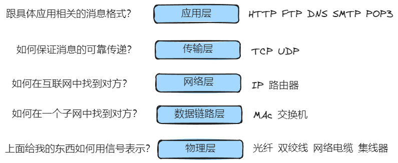
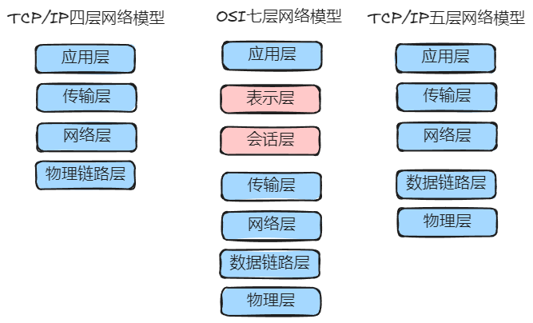

# 网络分层模型和应用协议

## 分层模型

### 五层网络模型



### 数据的传输

-   `发送信息`：经过每一层加一层信息头，直到物理层信息拆解转为信号，其中数据链路层还会加信息尾（封装）
-   `接收信息`：逐层传递逐层解析（解封装）

### 四层、五层、七层



## 应用层协议

### URL

-   URL 是一个固定格式的字符串，是 URI 的子集
-   [ schema ] \:// [ domain ] : [ port ] [ path ] [ quey ] [ hash ]
-   从网络中 `哪台计算机(domain)` 中的 `哪个程序(port)` 寻找 `哪个服务(path)` ，并注明了 `获取服务的具体细节(path)` ，以及要 `用什么样的协议通信(schema)`
-   协议是 http，端口是 80 可以省略
-   协议是 https，端口是 443 可以省略
-   schema domain path 必填

### HTTP

#### 传递消息的模式

请求 - 响应模式

#### 传递消息的格式

```
请求行/响应行 Line
请求头/响应头 Header

请求体/响应体 Body
```
