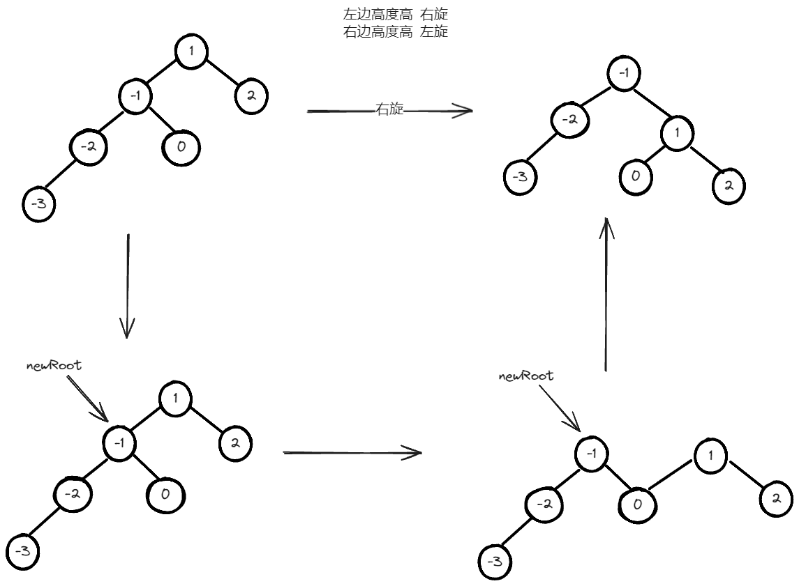

# 前端必会算法（三）

## Prim 算法

```JavaScript
function Prim(points, distance, start) {
  const result = [];
  result.push(start);
  const visited = new Set();
  visited.add(start);
  while (result.length < points.length) {
    let minDistance = Infinity;
    let minPoint = null;
    for (let i = 0; i < result.length; i++) {
      const point = result[i];
      for (let j = 0; j < points.length; j++) {
        const otherPoint = points[j];
        if (visited.has(otherPoint)) {
          continue;
        }
        const dist = distance(point, otherPoint);
        if (dist < minDistance) {
          minDistance = dist;
        }
        minPoint = otherPoint;
      }
    }
    if (minPoint) {
      result.push(minPoint);
      visited.add(minPoint);
    } else {
      break;
    }
  }
  return result;
}
```

## Kruskal 算法

```JavaScript
function Kruskal(points, edges) {
  const result = [];
  const parent = new Map();
  const rank = new Map();
  for (const point of points) {
    parent.set(point, point);
    rank.set(point, 0);
  }
  edges.sort((a, b) => a.distance - b.distance);
  for (const edge of edges) {
    const { point1, point2, distance } = edge;
    const root1 = find(parent, point1);
    const root2 = find(parent, point2);
    if (root1 !== root2) {
      result.push({ point1, point2, distance });
      union(parent, rank, root1, root2);
    }
  }
  return result;
}

function find(parent, point) {
  if (parent.get(point) !== point) {
    parent.set(point, find(parent, parent.get(point)));
  }
  return parent.get(point);
}

function union(parent, rank, root1, root2) {
  if (rank.get(root1) > rank.get(root2)) {
    parent.set(root2, root1);
  } else if (rank.get(root1) < rank.get(root2)) {
    parent.set(root1, root2);
  } else {
    parent.set(root2, root1);
    rank.set(root1, rank.get(root1) + 1);
  }
}
```

## 构建二叉搜索树

```JavaScript
function buildBST(arr) {
  function _insert(node, val) {
    if (!node) return new Node(val);
    if (val < node.val) {
      node.left = _insert(node.left, val);
    } else {
      node.right = _insert(node.right, val);
    }
    return node;
  }

  if (!arr || !arr.length) return null;
  const root = new Node(arr[0]);
  for (const item of arr) {
    insert(root, item);
  }
  return root;
}
```

## 二叉树单旋



```JavaScript
function rightRotate(root) {
  if (!root || !root.left) return root;
  const newRoot = root.left;
  root.left = newRoot.right;
  newRoot.right = root;
  return newRoot;
}
function leftRotate(root) {
  if (!root || !root.right) return root;
  const newRoot = root.right;
  root.right = newRoot.left;
  newRoot.left = root;
  return newRoot;
}
function change(root) {
  if (!root) return null;
  root.left = change(root.left);
  root.right = change(root.right);

  const leftHeight = getHeight(root.left);
  const rightHeight = getHeight(root.right);
  if (Math.abs(leftHeight - rightHeight) <= 1) return root;

  // LL 型（左子树更高，且左子树的左子树更高）
  if (
    leftHeight > rightHeight &&
    getHeight(root.left.left) >= getHeight(root.left.right)
  ) {
    return rightRotate(root);
  }

  // LR 型（左子树更高，且左子树的右子树更高）
  if (
    leftHeight > rightHeight &&
    getHeight(root.left.left) < getHeight(root.left.right)
  ) {
    root.left = leftRotate(root.left);
    return rightRotate(root);
  }

  // RR 型（右子树更高，且右子树的右子树更高）
  if (
    rightHeight > leftHeight &&
    getHeight(root.right.right) >= getHeight(root.right.left)
  ) {
    return leftRotate(root);
  }

  // RL 型（右子树更高，且右子树的左子树更高）
  if (
    rightHeight > leftHeight &&
    getHeight(root.right.right) < getHeight(root.right.left)
  ) {
    root.right = rightRotate(root.right);
    return leftRotate(root);
  }

  return root;
}
```
