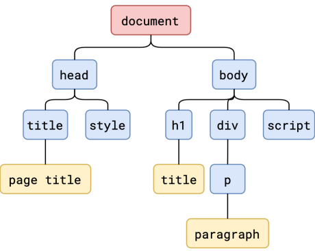
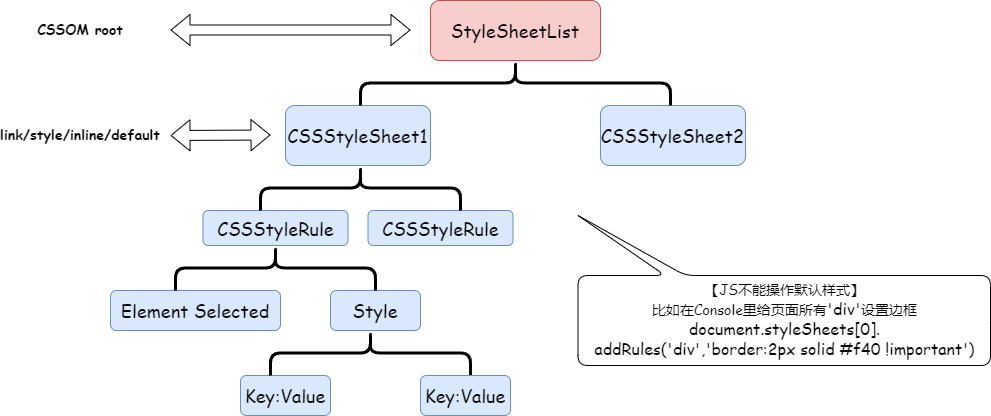
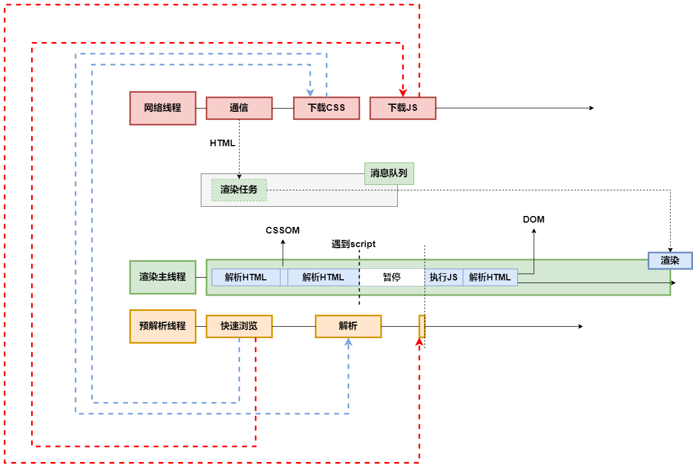
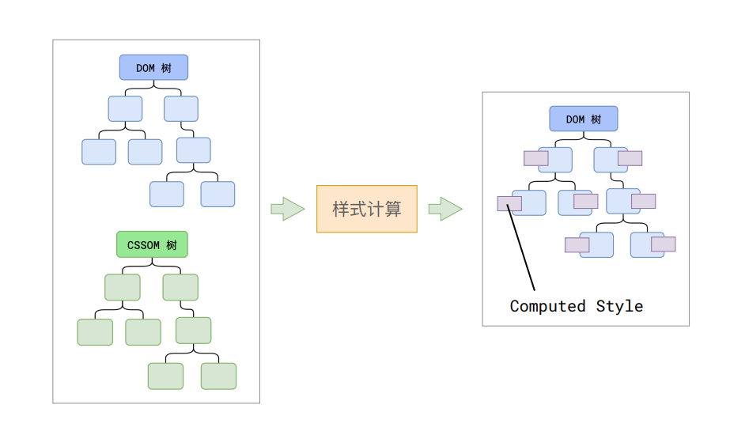
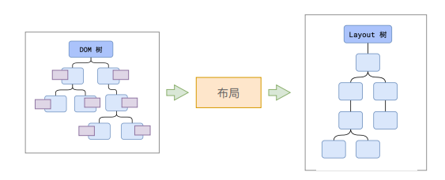
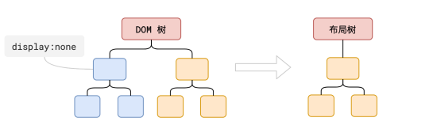
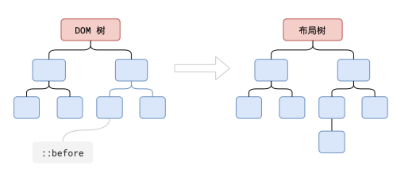
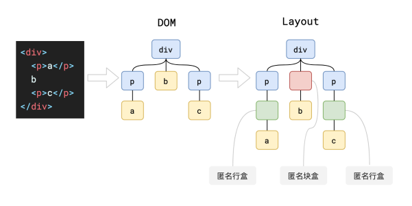

# 浏览器渲染原理

## 什么是渲染

渲染，英文为 `render`。在前端人员经常使用的 Vue 或者 React 等诸如此类的框架，渲染的目的就是得到框架想要的 `Virtual DOM`。而在浏览器这一部分，渲染的含义就是把字符串转换为像素信息，显示在屏幕上。我们可以将 render 理解为这样一个样貌：

```js
function render(html) {
  // ...
  return pixels;
}
```

## 渲染流程

有这样一道面试题：`浏览器输入 URL 到页面展示，发生了什么？`

这个问题，其实分为了两个部分。第一个部分是：从输入 URL 到请求返回的过程。第二个部分是：从请求返回到页面展示的过程。

简单来讲，这里面包含了 **网络** 与 **浏览器** 渲染两部分知识。

### Parse HTML

这一步的最终目标就是为了得到 DOM 树和 CSSOM 树。





在解析 HTML 的过程中，如果遇到了 CSS 和 JS 外部文件，将会如下操作：



## Recalculate Style



对于这一部分，我在[另一篇文章](../CSS/computed.md)里已经有过说明，于是此处不再赘述。

### Layout 布局



此时，我们需要注意 DOM 树 和 Layout 树不一定是一一对应的：

- `display: none` 的节点没有几何信息，因此不会生成到布局树中。

  

- `伪元素` 虽然不存在于 DOM 树中，但它们拥有几何信息，因此会生成到布局树中。

  

- `匿名行盒` 和 `匿名块盒` 不会出现在 DOM 树中，但它们拥有几何信息，因此会生成到布局树中。

  

:::warning

- 元素的内容必须在行盒中。
- 行盒和块盒不可以相邻。

:::

## 面试题

### 浏览器是如何渲染页面的？

1. 当浏览器的网络线程接收到 HTML 文档后，会产生一个渲染任务，并将其传递给渲染主线程的消息队列。在事件循环机制的作用下，渲染主线程取出消息队列中的渲染任务，开启渲染流程。

2. 整个渲染流程分为多个阶段，分别是 `HTML 解析`、`样式计算`、`布局`、`分层`、`绘制`、`分块`、`光栅化`、`绘制像素信息`。每个阶段都有明确的输入输出，上一阶段的输出会成为下一个阶段的输入，如此形成了一套完整的渲染流水线。

3. 渲染的第一步是解析HTML。

   解析过程中遇到 CSS 解析 CSS，遇到 JS 解析 JS。为了提高解析效率，浏览器在开始解析前会启动一个预解析的线程，率先下载 HTML 中的外部 CSS 文件和外部的 JS 文件。

   这也就是为什么如果主线程解析到 link 位置，外部的 CSS 文件还没有下载解析好的时候，主线程不会等待，反而继续解析后续 HTML 的原因 —— 就是因为下载和解析CSS的工作实在预解析线程中进行的。<mark>这就是CSS不会阻塞HTML解析的根本原因。</mark>

   如果主线程解析到 script 位置，会停止解析 HTML，转而等待 JS 文件下载好，并将全局代码解析执行完成后才能继续解析 HTML。这是因为 JS 代码执行过程可能会修改当前的 DOM 树，所以 DOM 树的生成必须暂停。<mark>这就是 JS 会阻塞HTML解析的根本原因。</mark>

   第一步完成后会得到 DOM 树和 CSSOM 树，浏览器的默认样式、内部样式、外部样式、行内样式均会包含在 CSSOM 树中。

4. 渲染的第二步是计算样式。

   主线程会遍历得到的 DOM 树，依次为树中的每个节点计算出它最终的样式，称之为 `Computed Style`。

   <mark>在这一过程中很多预设值会变成绝对值，比如 red 变为rgb ( 255, 0, 0 )；相对单位会变成绝对单位，比如 em 变为 px。</mark>

   这一步完成后会得到一棵带有样式的 DOM 树。

5. 接第三步是布局，布局完成后得到 `布局树`。

   布局阶段会依次遍历 DOM 树的每一个节点，计算每个节点的几何信息。例如节点的宽高、相对包含块的位置。

   <mark>大部分时候 DOM 树和布局树并非一一对应。</mark>

   比如 display:none 的节点没有集合信息，因此不会生成到布局树；又比如使用了伪元素选择器，虽然 DOM 树中不存在这些伪元素节点，但它们拥有几何信息，所以会生成到布局树中。还有匿名行盒，匿名块盒等等都会导致 DOM 树和布局树无法一一对应。

6. 第四步是分层。

   主线程会使用一套复杂的策略对整个布局树中进行分层。

   分层的好处在于，将来某一个层改变后，仅会对该层进行后续处理，从而 `提升效率`。

   <mark>滚动条、堆叠上下文、transform、opacity 等样式都会或多或少的影响分层结果，也可以通过 will-change 属性更大程度的影响分层结果。</mark>

7. 第五步是绘制。

   主线程会为每个层单独产生绘制指令集，用于描述这一层的内容该如何画出来。

   渲染主线程的工作到此为止，剩余步骤交给其他线程完成。

8. 接下来进入浏览器渲染的第六 —— 完成绘制后，主线程将每个图层的绘制信息提交给 `合成线程`，剩余工作由合成线程完成。

   合成线程首先对每个图层进行分块，将其划分为更多的小区域。它会从线程池中拿取 `多个线程` 来完成分块工作。

9. 渲染的第七步，分块完成后进入光栅化阶段。

   合成线程会将信息交给 `GPU 进程`，以极高的速度完成光栅化。

   GPU 进程会开启 `多个线程` 来完成光栅化，并且优先处理靠近视口区域的块。

   光栅化的结果就是一块一块的 `位图`。

10. 最后一个阶段就是画了。

    合成进程拿到每个层、每个块的位图后，生成一个个指引 ( quad ) 信息。`quad` 会标识出每个位图应该画到屏幕的哪个位置，以及会考虑到旋转、缩放等变形。

    <mark>变形发生在合成线程，与渲染主线程无关，这就是 transform 效率高的本质原因。</mark>

    合成线程会把 quad 提交给 `GPU 进程`，由 GPU 进程产生系统调用，提交给GPU硬件，完成最终的屏幕成像。
