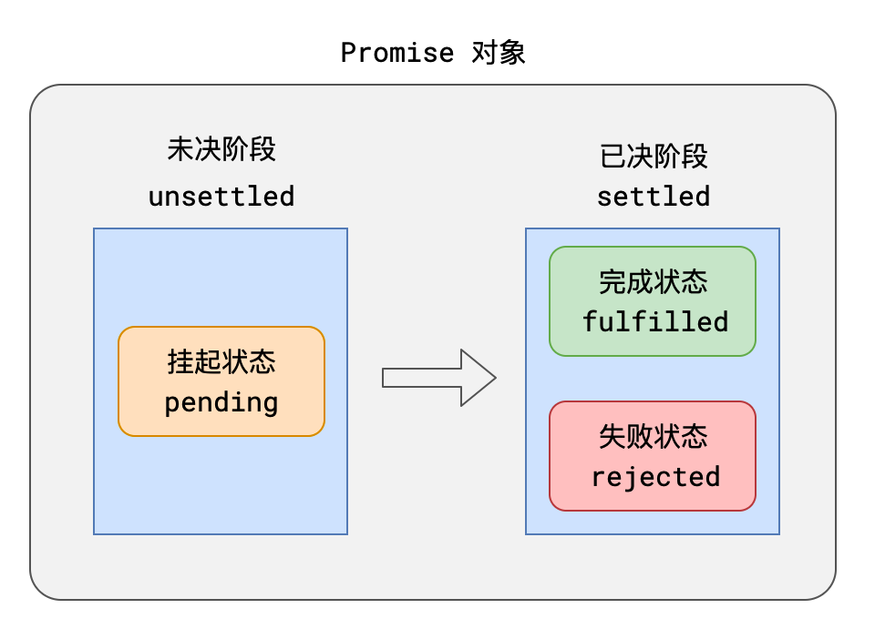
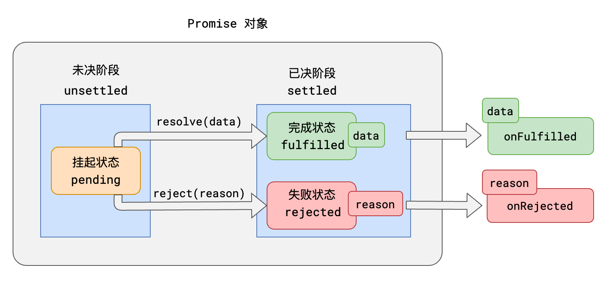

# Promise

## Promise 规范

Promise是一套专门处理异步场景的规范，它能有效的避免回调地狱的产生，使异步代码更加清晰、简洁、统一。

这套规范最早诞生于前端社区，规范名称为 [Promise A+](https://promisesaplus.com/)。

该规范出现后，立即得到了很多开发者的响应。

Promise A+ 规定：

1. 所有的异步场景，都可以看作是一个异步任务，每个异步任务，在JS中应该表现为一个 **对象**，该对象称之为 **Promise对象**，也叫做任务对象。

   

2. 每个任务对象，都应该有两个阶段、三个状态。

   

   根据常理，它们之间存在以下逻辑：

   - 任务总是从未决阶段变到已决阶段，无法逆行。
   - 任务总是从挂起状态变到完成或失败状态，无法逆行。
   - 时间不能倒流，历史不可改写，任务一旦完成或失败，状态就固定下来，永远无法改变。

3. `挂起->完成`，称之为 `resolve`；`挂起->失败` 称之为 `reject`。任务完成时，可能有一个相关数据；任务失败时，可能有一个失败原因。

   

4. 可以针对任务进行后续处理，针对完成状态的后续处理称之为 `onFulfilled`，针对失败的后续处理称之为 `onRejected。`

   

## Promise API

ES6提供了一套API，实现了Promise A+规范

基本使用如下：

```js
// 创建一个任务对象，该任务立即进入 pending 状态
const pro = new Promise((resolve, reject) => {
  // 任务的具体执行流程，该函数会立即被执行
  // 调用 resolve(data)，可将任务变为 fulfilled 状态， data 为需要传递的相关数据
  // 调用 reject(reason)，可将任务变为 rejected 状态，reason 为需要传递的失败原因
});

pro.then(
  (data) => {
    // onFulfilled 函数，当任务完成后，会自动运行该函数，data为任务完成的相关数据
  },
  (reason) => {
    // onRejected 函数，当任务失败后，会自动运行该函数，reason为任务失败的相关原因
  },
);
```

> 至此，回调地狱的问题仍然没能解决
>
> 要解决回调地狱，还需要进一步学习Promise的知识

## catch方法

`.catch(onRejected)` = `.then(null, onRejected)`

## 链式调用


1. then方法必定会返回一个新的 Promise。

   可理解为`后续处理也是一个任务`。

2. 新任务的状态取决于后续处理：

   - 若没有相关的后续处理，新任务的状态和前任务一致，数据为前任务的数据。

   - 若有后续处理但还未执行，新任务挂起。
   - 若后续处理执行了，则根据后续处理的情况确定新任务的状态：
     - 后续处理执行无错，新任务的状态为完成，数据为后续处理的返回值。
     - 后续处理执行有错，新任务的状态为失败，数据为异常对象。
     - 后续执行后返回的是一个任务对象，新任务的状态和数据与该任务对象一致。

由于链式任务的存在，异步代码拥有了更强的表达力。

```js
// 常见任务处理代码

/*
 * 任务成功后，执行处理1，失败则执行处理2
 */
pro.then(处理1).catch(处理2);

/*
 * 任务成功后，依次执行处理1、处理2
 */
pro.then(处理1).then(处理2);

/*
 * 任务成功后，依次执行处理1、处理2，若任务失败或前面的处理有错，执行处理3
 */
pro.then(处理1).then(处理2).catch(处理3);
```

## Promise的静态方法

| 方法名                       | 含义                                                             |
| ---------------------------- | ---------------------------------------------------------------- |
| Promise.resolve(data)        | 直接返回一个完成状态的任务                                       |
| Promise.reject(reason)       | 直接返回一个拒绝状态的任务                                       |
| Promise.all(任务数组)        | 返回一个任务<br />任务数组全部成功则成功<br />任何一个失败则失败 |
| Promise.any(任务数组)        | 返回一个任务<br />任务数组任一成功则成功<br />任务全部失败则失败 |
| Promise.allSettled(任务数组) | 返回一个任务<br />任务数组全部已决则成功<br />该任务不会失败     |
| Promise.race(任务数组)       | 返回一个任务<br />任务数组任一已决则已决，状态和其一致           |

## 消除回调

有了Promise，异步任务就有了一种统一的处理方式。

有了统一的处理方式，ES官方就可以对其进一步优化。

ES7推出了两个关键字 `async` 和 `await`，用于更加优雅的表达 Promise。

### async

async关键字用于修饰函数，被它修饰的函数，一定返回 Promise。

```js
async function method1() {
  return 1; // 该函数的返回值是 Promise 完成后的数据
}

method1(); // Promise { 1 }

async function method2() {
  return Promise.resolve(1);
  // 若返回的是 Promise，则 method 得到的 Promise 状态和其一致
}

method2(); // Promise { 1 }

async function method3() {
  throw new Error(1); // 若执行过程报错，则任务是 rejected
}

method3(); // Promise { <rejected> Error(1) }
```

### await

`await` 关键字表示等待某个Promise完成，**它必须用于** `async` **函数中**：

```js
async function method() {
  const n = await Promise.resolve(1);
  console.log(n); // 1
}

// 上面的函数等同于
function method() {
  return new Promise((resolve, reject) => {
    Promise.resolve(1).then((n) => {
      console.log(n);
      resolve(1);
    });
  });
}
```

`await` 也可以等待其他数据：

```js
async function method() {
  const n = await 1; // 等同于 await Promise.resolve(1)
}
```

如果需要针对失败的任务进行处理，可以使用 `try-catch` 语法：

```js
async function method() {
  try {
    const n = await Promise.reject(123); // 这句代码将抛出异常
    console.log('成功', n);
  } catch (err) {
    console.log('失败', err);
  }
}

method(); // 输出： 失败 123
```

## 面试题

1. 下面代码的输出结果是什么？

   ```js
   const promise = new Promise((resolve, reject) => {
     console.log(1);
     resolve();
     console.log(2);
   });

   promise.then(() => {
     console.log(3);
   });

   console.log(4);
   ```

2. 下面代码的输出结果是什么？

   ```js
   const promise = new Promise((resolve, reject) => {
     console.log(1);
     setTimeout(() => {
       console.log(2);
       resolve();
       console.log(3);
     });
   });

   promise.then(() => {
     console.log(4);
   });

   console.log(5);
   ```

3. 下面代码的输出结果是什么？

   ```js
   const promise1 = new Promise((resolve, reject) => {
     setTimeout(() => {
       resolve();
     }, 1000);
   });
   const promise2 = promise1.catch(() => {
     return 2;
   });

   console.log('promise1', promise1);
   console.log('promise2', promise2);

   setTimeout(() => {
     console.log('promise1', promise1);
     console.log('promise2', promise2);
   }, 2000);
   ```

4. 下面代码的输出结果是什么？

   ```js
   async function m() {
     const n = await 1;
     console.log(n);
   }

   m();
   console.log(2);
   ```

5. 下面代码的输出结果是什么？

   ```js
   async function m() {
     const n = await 1;
     console.log(n);
   }

   (async () => {
     await m();
     console.log(2);
   })();

   console.log(3);
   ```

6. 下面代码的输出结果是什么？

   ```js
   async function m1() {
     return 1;
   }

   async function m2() {
     const n = await m1();
     console.log(n);
     return 2;
   }

   async function m3() {
     const n = m2();
     console.log(n);
     return 3;
   }

   m3().then((n) => {
     console.log(n);
   });

   m3();

   console.log(4);
   ```

7. 下面代码的输出结果是什么？

   ```js
   Promise.resolve(1).then(2).then(Promise.resolve(3)).then(console.log);
   ```

8. 下面代码的输出结果是什么？

   ```js
   var a;
   var b = new Promise((resolve, reject) => {
     console.log('promise1');
     setTimeout(() => {
       resolve();
     }, 1000);
   })
     .then(() => {
       console.log('promise2');
     })
     .then(() => {
       console.log('promise3');
     })
     .then(() => {
       console.log('promise4');
     });

   a = new Promise(async (resolve, reject) => {
     console.log(a);
     await b;
     console.log(a);
     console.log('after1');
     await a;
     resolve(true);
     console.log('after2');
   });

   console.log('end');
   ```

9. 下面代码的输出结果是什么？

   ```js
   async function async1() {
     console.log('async1 start');
     await async2();
     console.log('async1 end');
   }
   async function async2() {
     console.log('async2');
   }

   console.log('script start');

   setTimeout(function () {
     console.log('setTimeout');
   }, 0);

   async1();

   new Promise(function (resolve) {
     console.log('promise1');
     resolve();
   }).then(function () {
     console.log('promise2');
   });
   console.log('script end');
   ```

:::details 参考答案

1. 1 👉 2 👉 4 👉 3
2. 1 👉 5 👉 2 👉 3 👉 4
3. promise { &lt; pending &gt; } 👉 promise { &lt; pending &gt; } 👉 promise { &lt; undefined &gt; } 👉 promise { &lt; undefined &gt; }
4. 2 👉 1
5. 3 👉 1 👉 2
6. promise { &lt; pending &gt; } 👉 promise { &lt; pending &gt; } 👉 4 👉 1 👉 3 👉 1
7. 1
8. promise1 👉 undefined 👉 end 👉 promise2 👉 promise3 👉 promise4 👉 promise { &lt; pending &gt; } 👉 after1
9. script start 👉 async1 start 👉 async2 👉 promise1 👉 script end 👉 async1 end 👉 promise2 👉 setTimeout

:::
