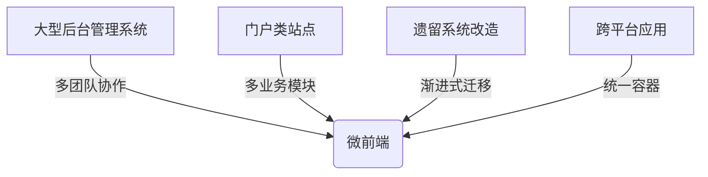

# 微前端架构演进之路

## 定义

面对不同的需求，前端开发者发现了传统的单体应用架构已经无法满足业务增长的需求，因此需要一种新的架构模式来解决这个问题。

| **需求**                           | **原则** |
| ---------------------------------- | -------- |
| 主应用要支持加载不同框架的子应用   | 独立开发 |
| 子应用不能共享 CSS 或 JS           | 独立运行 |
| 子应用维护者无需了解其他应用的细节 | 独立部署 |

<mark>微前端</mark> 是 微服务在前端的一种实践，是一种由独立交付的多个前端应用或模块组成整体的架构风格，将前端应用分解成一些更小、更简单的能够独立开发、测试、部署的应用或模块，而在用户看来仍然是内聚的单个产品。

## 破局单体应用之困

1. **巨石应用症候群**

   - 技术栈迭代滞后
   - 编译部署效率低下
   - 团队协作耦合严重

2. **业务扩展瓶颈**

   - 功能模块相互污染
   - 错误影响范围不可控
   - 渐进式重构难以实施

## 核心价值维度

| 维度         | 传统架构             | 微前端架构           |
| ------------ | -------------------- | -------------------- |
| **技术自主** | 强制统一技术栈       | 多技术栈并行         |
| **团队协作** | 高度耦合的代码仓库   | 独立开发部署的子系统 |
| **用户体验** | 全量更新的页面跳转   | 无缝切换的模块化体验 |
| **运维能力** | 牵一发而动全身的部署 | 渐进式更新与灰度发布 |

## 架构优势全景

1. **组织架构映射**：实现「两个披萨团队」原则，子系统团队自治。
2. **渐进式演进**：支持从遗留系统逐步迁移，降低改造风险。
3. **容错沙箱机制**：通过样式隔离、JS沙箱确保子系统运行时安全。
4. **性能优化空间**：按需加载子应用，首屏性能提升 30% ~ 50%。

## 适用场景图谱

