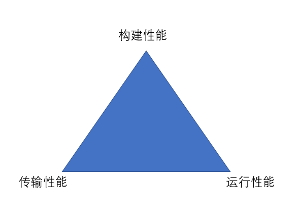
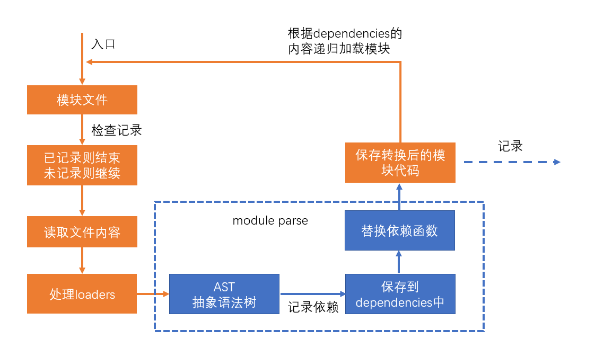
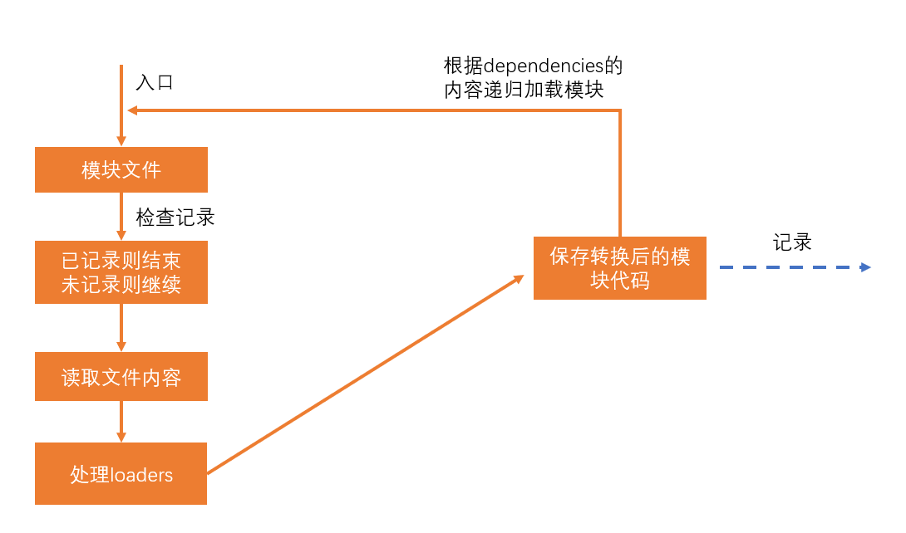
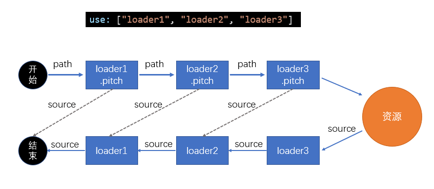
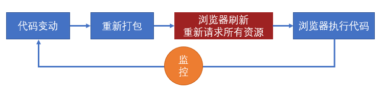
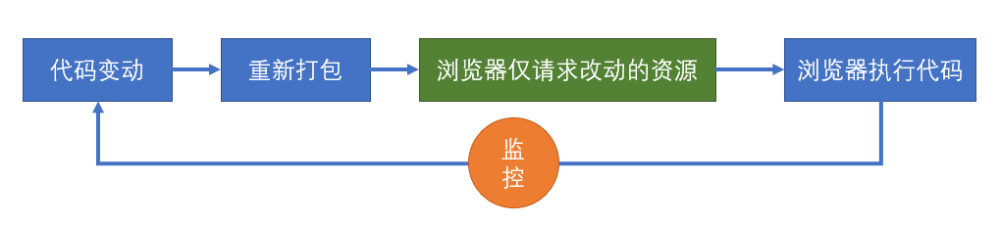
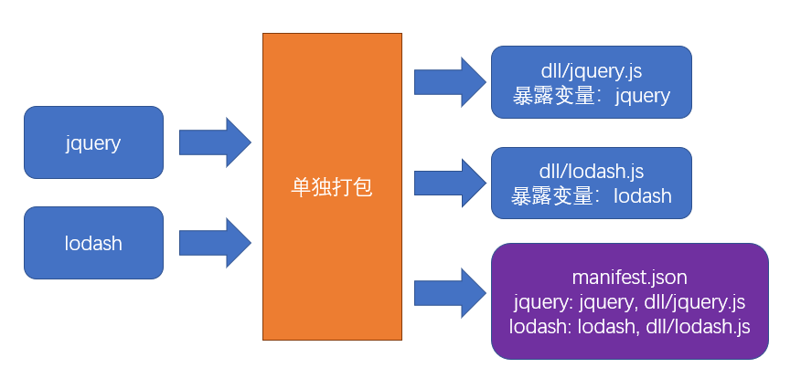

# 性能优化

## 概述

本章所讲的性能优化主要体现在三个方面：



### 构建性能

这里所说的构建性能，是指在 **开发阶段的构建性能**，而不是生产环境的构建性能。

优化的目标，**是降低从打包开始，到代码效果呈现所经过的时间**。

构建性能会影响开发效率。构建性能越高，开发过程中时间的浪费越少。

### 传输性能

传输性能是指，打包后的 JS 代码传输到浏览器经过的时间。

在优化传输性能时要考虑到：

1. 总传输量：所有需要传输的 JS 文件的内容加起来，就是总传输量，重复代码越少，总传输量越少。
2. 文件数量：当访问页面时，需要传输的 JS 文件数量，文件数量越多，http 请求越多，响应速度越慢。
3. 浏览器缓存：JS 文件会被浏览器缓存，被缓存的文件不会再进行传输。

### 运行性能

运行性能是指，JS 代码在浏览器端的运行速度。

它主要取决于我们如何书写高性能的代码。

**永远不要过早的关注于性能**，因为你在开发的时候，无法完全预知最终的运行性能，过早的关注性能会极大的降低开发效率。

性能优化主要从上面三个维度入手。

<mark>性能优化没有完美的解决方案，因为可能一方面的优化会引起另一方面性能的损耗，需要具体情况具体分析。</mark>

## 构建性能的优化

### 减少模块解析

首先，我们要了解什么是模块解析。



模块解析包括：抽象语法树分析、依赖分析、模块语法替换

那么，不做模块解析会发生什么？



如果某个模块不做解析，该模块经过 loader 处理后的代码就是最终代码。

如果没有 loader 对该模块进行处理，该模块的源码就是最终打包结果的代码。

如果不对某个模块进行解析，可以缩短构建时间。既然如此，什么样的模块可以不被解析？

模块中无其他依赖：一些已经打包好的第三方库，比如 jquery。

如何能保证这些第三方库不被解析呢？

配置 `module.noParse`，它是一个正则，被正则匹配到的模块不会解析。

### 优化 loader 性能

1. 进一步限制 loader 的应用范围

   思路是：对于某些库，不使用 loader。

   例如：babel-loader 可以转换 ES6 或更高版本的语法，可是有些库本身就是用 ES5 语法书写的，不需要转换，使用 babel-loader 反而会浪费构建时间

   lodash 就是这样的一个库，它是一个工具库，使用的是 ES3 语法。

   通过 `module.rule.exclude` 或 `module.rule.include`，排除或仅包含需要应用 loader 的场景

   ```JavaScript [webpack.config.js]
   module.exports = {
   module: {
       rules: [
       {
           test: /\.js$/,
           exclude: /lodash/,
           use: 'babel-loader'
       }
       ]
   }
   };
   ```

   如果暴力一点，甚至可以排除掉 `node_modules` 目录中的模块，或仅转换 `src` 目录的模块。

   ```JavaScript [webpack.config.js]
   module.exports = {
   module: {
       rules: [
       {
           test: /\.js$/,
           exclude: /node_modules/,
           //或
           // include: /src/,
           use: 'babel-loader'
       }
       ]
   }
   };
   ```

   > 这种做法是对 loader 的范围进行进一步的限制，和 noParse 不冲突，noParse 配置的模块仍然会被 loaders 处理。

2. 缓存 loader 的结果

   我们可以基于一种假设：如果某个文件内容不变，经过相同的 loader 解析后，解析后的结果也不变。

   于是，可以将 loader 的解析结果保存下来，让后续的解析直接使用保存的结果。

   `cache-loader` 可以实现这样的功能。

   ```JavaScript [webpack.config.js]
   module.exports = {
   module: {
       rules: [
       {
           test: /\.js$/,
           use: ['cache-loader', ...loaders]
       }
       ]
   }
   };
   ```

   有趣的是，`cache-loader`放到最前面，却能够决定后续的 loader 是否运行。

   实际上，loader 的运行过程中，还包含一个过程，即 `pitch`。

   

   `cache-loader` 还可以实现各自自定义的配置，具体方式见文档。

3. 为 loader 的运行开启多线程。

   `thread-loader` 会开启一个线程池，线程池中包含适量的线程。

   它会把后续的 loader 放到线程池的线程中运行，以提高构建效率。

   由于后续的 loader 会放到新的线程中，所以，后续的 loader 不能：

   - 使用 webpack api 生成文件
   - 无法使用自定义的 plugin api
   - 无法访问 webpack options

   > 在实际的开发中，可以进行测试，来决定 `thread-loader` 放到什么位置。

   :::warning
   开启和管理线程需要消耗时间，在小型项目中使用 `thread-loader` 反而会增加构建时间。
   :::

### 热替换 HMR

> 热替换并不能降低构建时间（可能还会稍微增加），但可以降低代码改动到效果呈现的时间。

当使用`webpack-dev-server`时，考虑代码改动到效果呈现的过程：



而使用了热替换后，流程发生了变化：



我们可以通过以下修改应用热更新：

:::code-group

```JavaScript [webpack.config.js]
module.exports = {
  devServer: {
    hot: true // 开启HMR
  },
  plugins: [
    // 可选
    new webpack.HotModuleReplacementPlugin()
  ]
};
```

```JavaScript [index.js]
if (module.hot) {
  // 是否开启了热更新
  module.hot.accept(); // 接受热更新
}
```

:::

首先，这段代码会参与最终运行！

当开启了热更新后，webpack-dev-server 会向打包结果中注入 module.hot 属性。

默认情况下，webpack-dev-server 不管是否开启了热更新，当重新打包后，都会调用 location.reload 刷新页面。

但如果运行了 module.hot.accept()，将改变这一行为。

module.hot.accept() 的作用是让 webpack-dev-server 通过 socket 管道，把服务器更新的内容发送到浏览器。


然后，将结果交给插件 HotModuleReplacementPlugin 注入的代码执行。

插件 HotModuleReplacementPlugin 会根据覆盖原始代码，然后让代码重新执行。

<mark>所以，热替换发生在代码运行期。</mark>

对于样式也是可以使用热替换的，但需要使用 style-loader。

因为热替换发生时，HotModuleReplacementPlugin 只会简单的重新运行模块代码。

因此 style-loader 的代码一运行，就会重新设置 style 元素中的样式。

而 mini-css-extract-plugin，由于它生成文件是在 **构建期间**，运行期间不会也无法改动文件，因此它对于热替换是无效的。

## 传输性能的优化

### 手动分包

手动分包的总体思路是：公共模块会被打包成为动态链接库(dll Dynamic Link Library)，并生成资源清单。



先来看以下的代码：

```JavaScript [index.js]
import $ from 'jquery';
import _ from 'lodash';
_.isArray($('.red'));
```

由于资源清单中包含 `jquery` 和 `lodash` 两个模块，因此打包结果的大致格式是：

```JavaScript
(function (modules) {
  //...
})({
  // index.js文件的打包结果并没有变化
  './src/index.js': function (module, exports, __webpack_require__) {
    var $ = __webpack_require__('./node_modules/jquery/index.js');
    var _ = __webpack_require__('./node_modules/lodash/index.js');
    _.isArray($('.red'));
  },
  // 由于资源清单中存在，jquery的代码并不会出现在这里
  './node_modules/jquery/index.js': function (
    module,
    exports,
    __webpack_require__
  ) {
    module.exports = jquery;
  },
  // 由于资源清单中存在，lodash的代码并不会出现在这里
  './node_modules/lodash/index.js': function (
    module,
    exports,
    __webpack_require__
  ) {
    module.exports = lodash;
  }
});
```

但如果我们同时有多个入口，并且这些入口都依赖了相同的公共库，那么打包结果都会像上面一样，就连公共库也会被打包多次，这显然并不是我们所期望的。

如果可能的话，我们想要让这些公共库的打包结果被抽离成仅此一份的。

<mark>打包公共模块是一个独立的打包过程。</mark>

1. 单独打包公共模块，暴露变量名。

   ```JavaScript [webpack.dll.config.js]
   module.exports = {
     mode: 'production',
     entry: {
      jquery: ['jquery'],
      lodash: ['lodash']
     },
     output: {
       filename: 'dll/[name].js',
       library: '[name]'
     }
   };
   ```

2. 利用 `DllPlugin` 生成资源清单。

   ```JavaScript [webpack.dll.config.js]
   module.exports = {
     // ...
     plugins: [
       new webpack.DllPlugin({
         //资源清单的保存位置
         path: path.resolve(__dirname, 'dll', '[name].manifest.json'),
         //资源清单中，暴露的变量名
         name: '[name]'
       })
     ]
   };
   ```

运行后，即可完成公共模块打包。

那在我们打包之后，又该如何使用这些公共模块呢？

1. 在页面中手动引入公共模块。

   ```html
   <script src="./dll/jquery.js"></script>
   <script src="./dll/lodash.js"></script>
   ```

2. 重新设置 `clean-webpack-plugin`。

   如果使用了插件 `clean-webpack-plugin`，为了避免它把公共模块清除，需要做出以下配置：

   ```JavaScript
   new CleanWebpackPlugin({
       // 要清除的文件或目录
       // 排除掉dll目录本身和它里面的文件
       cleanOnceBeforeBuildPatterns: ['**/*', '!dll', '!dll/*']
   });
   ```

   > 目录和文件的匹配规则使用的是 [globbing patterns](https://github.com/sindresorhus/globby#globbing-patterns)。

3. 使用 `DllReferencePlugin` 控制打包结果。

   ```JavaScript
   module.exports = {
     plugins: [
       new webpack.DllReferencePlugin({
         manifest: require('./dll/jquery.manifest.json')
       }),
       new webpack.DllReferencePlugin({
         manifest: require('./dll/lodash.manifest.json')
       })
     ]
   };
   ```

:::info 总结

- 手动打包的过程

  1. 开启`output.library`暴露公共模块
  2. 用`DllPlugin`创建资源清单
  3. 用`DllReferencePlugin`使用资源清单

- 手动打包的注意事项

  1. 资源清单不参与运行，可以不放到打包目录中
  2. 记得手动引入公共JS，以及避免被删除
  3. 不要对小型的公共JS库使用

- 优点

  1. 极大提升自身模块的打包速度
  2. 极大的缩小了自身文件体积
  3. 有利于浏览器缓存第三方库的公共代码

- 缺点

  1. 使用非常繁琐
  2. 如果第三方库中包含重复代码，则效果不太理想

:::
