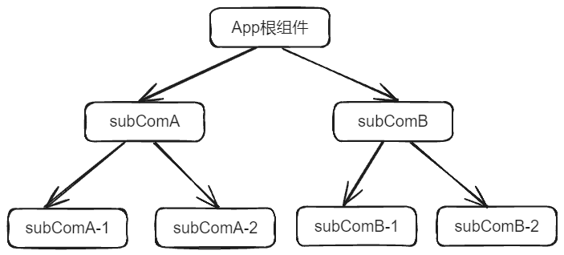
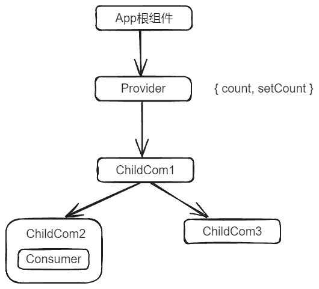
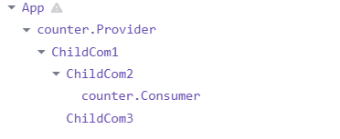
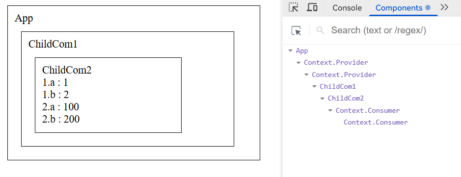

# Context

有关 Context，这是一个非常重要的知识点，甚至我们之后在书写 mini-react、mini-react-router、mini-redux 等等的时候，都会用到 Context。

搞懂 Context，主要包含以下几点：

- Context 解决的问题
- Context 的用法
- Context 的相关 Hook

## Context 解决的问题

正常来讲，SPA 中的组件会形成一个像组件树一样的结构，当内部组件和组件之间要进行数据传递时，就免不了一层一层先传递到共同的父组件，然后再一层一层传递下去。



假设 subComA-1 组件的状态数据要传递给 subComB-2 组件，应该怎么做？

根据我们前面所讲的单向数据流规则，那么数据应该被提升到 App 根组件，然后通过 props 一层一层地传递给下面的子组件，最终 subComA-1 拿到所需要的数据；如果 subComA-1 组件需要修改传递下来的数据，那么该组件还需要接收从 App 根组件一层一层传递下来的能够修改数据的方法。

官方在《何时使用 Context》这一节中举过一个形象的例子：<https://zh-hans.reactjs.org/docs/context.html#when-to-use-context>

因此，简单一句话概括 Context，那就是解决组件之间数据共享的问题，避免一层一层的传递。

此时你肯定会想，前面的 redux 不就已经解决了这个问题么？没错，实际上 redux 地实现原理就是基于 Context 所进行的一层封装。

## Context 的用法

### 基本使用

React 官方对于 Context 的用法，分为旧版 API 和新版 API，有关旧版 API，我们这里就不介绍了。

> <https://zh-hans.legacy.reactjs.org/docs/legacy-context.html#gatsby-focus-wrapper>

这里我们看一下新版 API 的使用，示例如下：

:::code-group

```JavaScript [context/index.js]
import React from 'react';
const MyContext = React.createContext();
export default MyContext;
```

```JSX [ChildCom1.jsx]
import React, { Component } from 'react';
import ChildCom2 from './ChildCom2';
import ChildCom3 from './ChildCom3';

export default class ChildCom1 extends Component {
  render() {
    return (
      <div
        style={{
          border: '1px solid',
          width: '300px',
          userSelect: 'none',
          margin: '10px',
          padding: '10px'
        }}
      >
        ChildCom1
        <ChildCom2 />
        <ChildCom3 />
      </div>
    );
  }
}
```

```JSX [ChildCom2.jsx]
import React from 'react';
import MyContext from '../context';

const { Consumer } = MyContext;

function ChildCom2() {
  return (
    <Consumer>
      {(ctx) => {
        console.log('🚀 ~ ChildCom2.jsx:10 ~ ChildCom2 ~ ctx:', ctx);
        return (
          <div
            style={{
              border: '1px solid',
              width: '200px',
              userSelect: 'none',
              margin: '10px',
              padding: '10px'
            }}
            onClick={() => ctx.setCounter(ctx.counter + 1)}
          >
            ChildCom2 --- counter : {ctx.counter}
          </div>
        );
      }}
    </Consumer>
  );
}

export default ChildCom2;
```

```JSX [ChildCom3.jsx]
import React, { Component } from 'react';
import MyContext from '../context';

export default class ChildCom3 extends Component {
  static contextType = MyContext;
  render() {
    return (
      <div
        style={{
          border: '1px solid',
          width: '200px',
          userSelect: 'none',
          margin: '10px',
          padding: '10px'
        }}
        onClick={() => this.context.setCounter(this.context.counter + 2)}
      >
        ChildCom3 --- counter : {this.context.counter}
      </div>
    );
  }
}
```

```JSX [App.jsx]
import React, { useState } from 'react';
import MyContext from './context';
import ChildCom1 from './components/ChildCom1';

const { Provider } = MyContext;
console.log('🚀 ~ App.jsx:6 ~ MyContext:', MyContext);

function App() {
  const [counter, setCounter] = useState(0);

  return (
    <Provider value={{ counter, setCounter }}>
      <div
        style={{
          border: '1px solid',
          width: '360px',
          userSelect: 'none',
          margin: '10px',
          padding: '10px'
        }}
      >
        <div>App</div>
        <ChildCom1 />
      </div>
    </Provider>
  );
}

export default App;
```

:::

整体的组件树结构图如下：



最后，我们来看一下效果：

<VideoPlayer platform="local" src='videos/React App - Google Chrome 2025-03-07 10-24-01.mp4'/>

### displayName

如果安装了 React Developer Tools，那么在 components 选项卡中可以看到组件树结构，默认的名字就为 Context.Provider 和 Context.Consumer，可以通过 displayName 来显式地修改名字。

```JSX
import React from 'react';
const MyContext = React.createContext({
  name: 'John Doe'
});
MyContext.displayName = 'counter';
export default MyContext;
```

效果如图：



### 默认值

在创建 context 时，可以提供一个默认值，当组件树中没有匹配的 Provider 时，会使用这个默认值。

:::code-group

```JavaScript [context/index.js]
import React from 'react';
const MyContext = React.createContext({
  name: '周末晚'
});
MyContext.displayName = 'counter';
export default MyContext;
```

```JSX [ChildCom1.jsx]
import React, { Component } from 'react';
import ChildCom2 from './ChildCom2';

export default class ChildCom1 extends Component {
  render() {
    return (
      <div
        style={{
          border: '1px solid',
          width: '300px',
          userSelect: 'none',
          margin: '10px',
          padding: '10px'
        }}
      >
        ChildCom1
        <ChildCom2 />
      </div>
    );
  }
}
```

```JSX [ChildCom2.jsx]
import React from 'react';
import MyContext from '../context';

const { Consumer } = MyContext;

function ChildCom2() {
  return (
    <Consumer>
      {(ctx) => {
        return (
          <div
            style={{
              border: '1px solid',
              width: '200px',
              userSelect: 'none',
              margin: '10px',
              padding: '10px'
            }}
          >
            ChildCom2 --- name : {ctx.name}
          </div>
        );
      }}
    </Consumer>
  );
}

export default ChildCom2;
```

```JSX [App.jsx]
import React from 'react';
import MyContext from './context';
import ChildCom1 from './components/ChildCom1';

function App() {
  return (
    <div
      style={{
        border: '1px solid',
        width: '360px',
        userSelect: 'none',
        margin: '10px',
        padding: '10px'
      }}
    >
      <div>App</div>
      <ChildCom1 />
    </div>
  );
}

export default App;
```

:::

:::warning
**提供默认之之后不需要 Provider 组件来提供数据**，此时子组件可以直接消费上下文环境的默认数据，否则会导致无法渲染默认数据。
:::

### 多个上下文环境

在上面的示例中，我们示例的都是一个 context 上下文环境，这通常也够用了。但是，这并不意味着只能提供一个上下文环境，我们可以创建多个上下文环境，示例如下：

:::code-group

```JavaScript [context/index.js]
import React from 'react';
export const MyContext1 = React.createContext();
export const MyContext2 = React.createContext();
```

```JSX [ChildCom2.jsx]
import React from 'react';
import { MyContext1, MyContext2 } from '../context';

function ChildCom2() {
  return (
    <MyContext1.Consumer>
      {(ctx1) => {
        return (
          <MyContext2.Consumer>
            {(ctx2) => {
              return (
                <div
                  style={{
                    border: '1px solid',
                    width: '200px',
                    userSelect: 'none',
                    margin: '10px',
                    padding: '10px'
                  }}
                >
                  ChildCom2
                  <div> 1.a : {ctx1.a}</div>
                  <div> 1.b : {ctx1.b}</div>
                  <div> 2.a : {ctx2.a}</div>
                  <div> 2.b : {ctx2.b}</div>
                </div>
              );
            }}
          </MyContext2.Consumer>
        );
      }}
    </MyContext1.Consumer>
  );
}

export default ChildCom2;
```

```JSX [App.jsx]
import React from 'react';
import { MyContext1, MyContext2 } from './context';
import ChildCom1 from './components/ChildCom1';

function App() {
  return (
    <MyContext1.Provider value={{ a: 1, b: 2 }}>
      <MyContext2.Provider value={{ a: 100, b: 200 }}>
        <div
          style={{
            border: '1px solid',
            width: '360px',
            userSelect: 'none',
            margin: '10px',
            padding: '10px'
          }}
        >
          <div>App</div>
          <ChildCom1 />
        </div>
      </MyContext2.Provider>
    </MyContext1.Provider>
  );
}

export default App;
```

:::

效果图如下：



:::tip
如果在多个上下文环境中，出现了同名的属性，那么会按照上下文环境从里到外的顺序进行覆盖。
:::

## Context Hook

在 React Hook API 中，为我们提供了一个更加方便的 useContext 钩子函数。该 Hook 接收一个由 React.createContext API 创建的上下文对象，并返回该 context 的值。

例如：

```JSX [ChildCom2.jsx]
import React from 'react';
import { MyContext1 } from '../context';

function ChildCom2() {
  const { a, b } = React.useContext(MyContext1);
  return (
    <div>
      <h1>ChildCom2</h1>
      <p>{a}</p>
      <p>{b}</p>
    </div>
  );
}

export default ChildCom2;
```

useContext(MyContext1) 相当于类组件中的 `static contextType = MyContext1` 或者 `<MyContext1.Consumer>`。但是我们 **仍然需要在上层组件树中使用** `<MyContext1.Provider>` **来为下层组件提供 context**。
