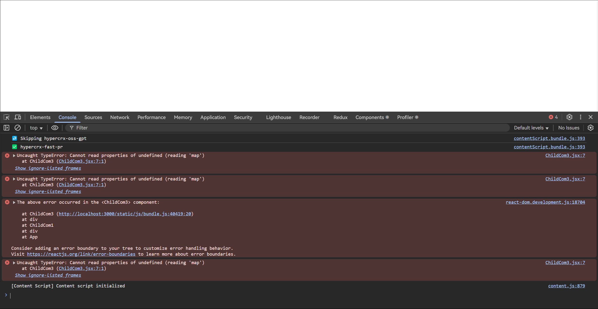

# 错误边界

首先，我们来看以下示例：

:::code-group

```JSX [App.jsx]
import React from 'react';
import ChildCom1 from './components/ChildCom1';
import ChildCom2 from './components/ChildCom2';

function App() {
  return (
    <div
      style={{
        padding: '20px',
        border: '1px solid black'
      }}
    >
      APP
      <ChildCom1 />
      <ChildCom2 />
    </div>
  );
}

export default App;
```

```JSX [ChildCom1.jsx]
import React from 'react';
import ChildCom3 from './ChildCom3';

function ChildCom1() {
  return (
    <div
      style={{
        width: '300px',
        height: '300px',
        border: '1px solid black'
      }}
    >
      ChildCom1
      <ChildCom3 />
    </div>
  );
}

export default ChildCom1;
```

```JSX [ChildCom2.jsx]
import React from 'react';

function ChildCom2() {
  return (
    <div
      style={{
        width: '300px',
        height: '300px',
        border: '1px solid black'
      }}
    >
      ChildCom2
    </div>
  );
}

export default ChildCom2;
```

```JSX [ChildCom3.jsx] {3}
import React from 'react';

function getData() {}

function ChildCom3() {
  const arr = getData();
  const list = arr.map((item, index) => <li key={index}>{item}</li>);

  return (
    <ul>
      ChildCom3
      {list}
    </ul>
  );
}

export default ChildCom3;
```

:::

运行如上代码，可以发现，当 `getData()` 函数出错时，整个页面都会崩溃，并且控制台会报错，如下：



这在某些场景下，实际上是没有必要的。例如，有问题的组件是广告、或者一些无关紧要的组件，此时我们就期望渲染出问题组件以外的组件树。

错误边界就是用来解决这个问题的。

> 错误边界是一种 React 组件，这种组件可以捕获发生在其子组件树任何位置的 JavaScript 错误，并打印这些错误，同时展示降级 UI，而并不会渲染那些发生崩溃的子组件树。错误边界可以捕获发生在整个子组件树的渲染期间、生命周期方法以及构造函数中的错误。

:::code-group

```JSX [ErrorBoundary.jsx]
import React, { Component } from 'react';

export default class ErrorBoundary extends Component {
  constructor(props) {
    super(props);
    this.state = {
      hasError: false
    };
  }

  static getDerivedStateFromError(error) {
    // 更新 state 使下一次渲染能够显示降级 UI
    console.log('🤡 ~ getDerivedStateFromError', error);
    return { hasError: true };
  }

  componentDidCatch(error, errorInfo) {
    // 你同样可以将错误日志上报给服务器
    console.log('👻 ~ componentDidCatch', error, errorInfo);
  }

  render() {
    if (this.state.hasError) {
      // 展示降级 UI
      return <div>ErrorBoundary</div>;
    }
    return this.props.children;
  }
}
```

```JSX [ChildCom1.jsx]
import React from 'react';
import ChildCom3 from './ChildCom3';
import ErrorBoundary from './ErrorBoundary';

function ChildCom1() {
  return (
    <div
      style={{
        width: '300px',
        height: '300px',
        border: '1px solid black'
      }}
    >
      ChildCom1
      <ErrorBoundary>
        <ChildCom3 />
      </ErrorBoundary>
    </div>
  );
}

export default ChildCom1;
```

:::

在上面的代码中，我们就创建了一个错误边界组件。该组件有一个 `getDerivedStateFromError` 静态方法以及 `componentDidCatch` 实例方法，这两个方法都会在组件渲染出错时调用，但是略有区别，具体的区别如下：

- `getDerivedStateFromError` 静态方法：
  - 运行时间点：渲染自组建的过程中，发生错误之后，在更新页面之前。
  - **注意：只有子组件发生错误，才会运行该函数。**
  - 该函数返回一个对象，React 会将该对象的属性覆盖掉当前组件的 state。
  - 参数：错误对象。
  - 通常，该函数用于改变状态。
- `componentDidCatch` 实例方法：
  - 运行时间点：渲染自子组件的过程中，发生错误，更新页面之后，由于其运行时间点比较靠后，因此不太会在该函数中改变状态。
  - 通常，该函数用于记录错误消息。

> 最佳实践，使用 static getDerivedStateFromError(error) 来渲染备用 UI，使用 componentDidCatch(error, errorInfo) 来记录错误信息。

最后需要注意的是，错误边界组件主要是用来捕获 UI 渲染时的错误，因此如下场景中错误是无法捕获的：

- 事件处理
- 异步代码
- 服务端渲染
- 它自身抛出来的错误（不是它子组件抛出来的错误）

总之，错误边界组件仅能够处理 **渲染子组件树期间的同步错误**。
