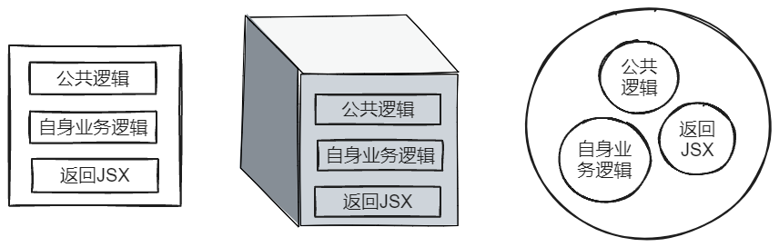
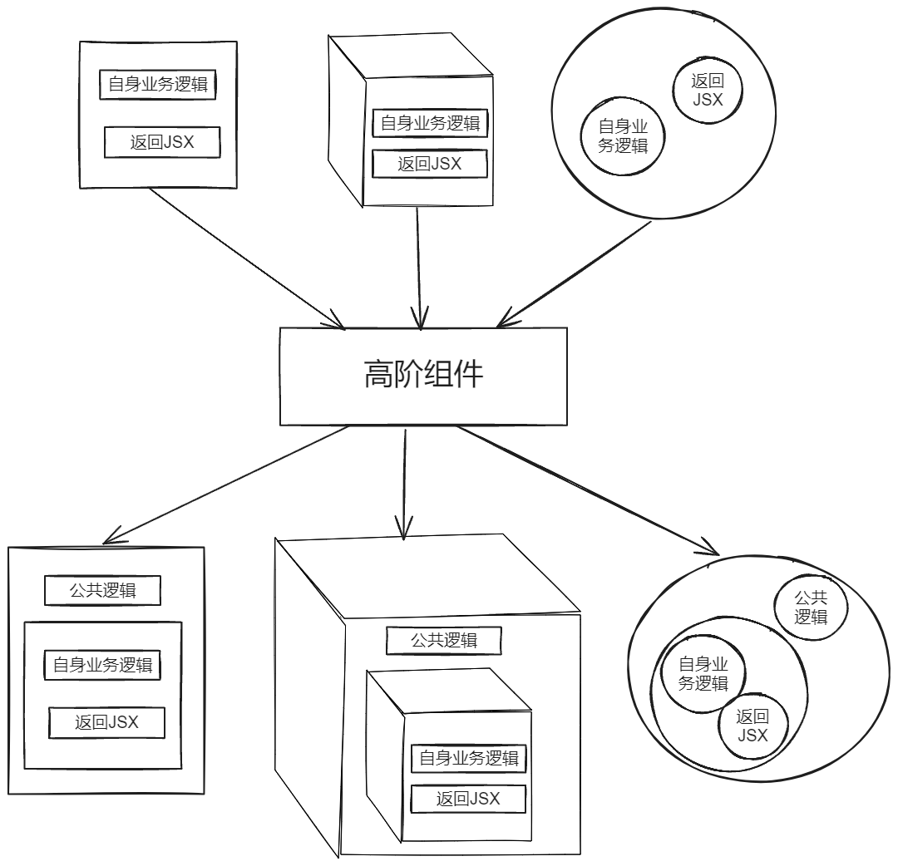
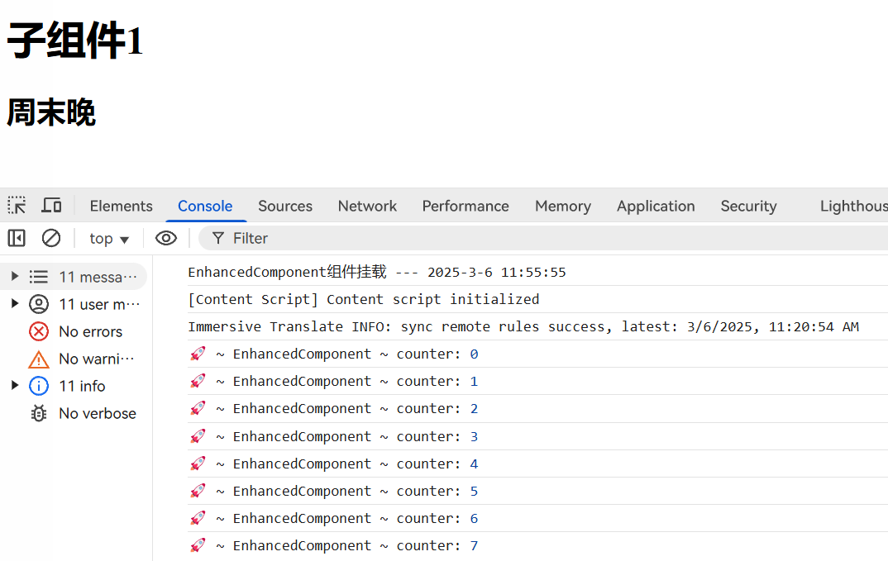

# 高阶组件

高阶组件英语全称称为 Higher-Order Component，简称 HOC，是 React 中用于复用组件逻辑的一种高级技巧。

高阶组件的学习，主要有下面两个点：

- 认识到高阶组件并非是一个组件，而是增强组件功能的一个函数。
- 高阶组件的作用是对多组件公共逻辑进行横向抽离。

## 高阶组件是一个函数

这个点非常有意思，很多人一看到这个名字，自然认为高阶组件是一个组件，但是汪汪有些名字具有欺骗性，比如 JavaScript 会被误认为和 Java 相关。

官方对高阶组件给出了很明确的定义，甚至给出了一个公式：

> 高阶组件是参数为组件，返回值为新组件的函数。
>
> ```js
> const EnhancedComponent = higherOrderComponent(WrappedComponent);
> ```

## 高阶组件要做的事情

高阶组件作为一个函数，接收你传入的组件，然后又返回一个新组建给你。在这期间，高阶组件的内部对原有的组件会做一些增强操作。

那么，什么叫做对组件 **公共逻辑** 进行 **横向抽离** 呢？



假设我们这里有三个组件，每个组件有一部分 **公共逻辑**，一部分该组件自身的 **业务逻辑**，那么很明显，每个组件都书写一遍这样的公共逻辑是不划算的。

作为一个程序员，我们自然而然想到的就是把这部分公共逻辑提取出来。

早期的 React 采用的是 mixins 来解决这种横切关注点相关的问题。Mixins 的原理可以简单理解为将一个 minxin 对象上的方法增加到组件上。

```js
const mixinDefaultProps = {};
const ExampleComponent = React.createClass({
  mixins: [mixinDefaultProps],
  render: function () {},
});
```

眼熟不？没错，在 Vue 2.x 中也支持 mixins 这样的混合注入。

不过这只能在 React 的旧语法 React.createClass 中使用，目前已经不再推荐使用了。

> mixins 问题
>
> - mixins 引入了隐式的依赖关系
>
> 你可能会写一个有状态的组件，然后你的同事可能添加一个读取这个组件 state 的mixin，几个月之后，你可能希望该 state 移动到父组件，以便与其兄弟组件共享。你会记得更新这个 mixin 来读取 props 而不是 state 嘛？如果此时，其他组件也在使用这个 mixin，那么你将不得不更新所有这些组件。这会让你陷入困境。
>
> - mixins 引起名称冲突
>
> 无法保证两个特定的 mixin 可以一起使用。例如，如果 FluxListenerMixin 和 WindowSizeMixin 都定义了 handleChange()，则不能一起使用它们。同时，你无法在自己的组件上定义具有此名称的方法。
>
> - mixins 导致滚雪球式的复杂性
>
> 每个新的需求都使得 mixins 更难理解，使用相同 mixin 的组件会随着时间的推移变得越来越耦合。任何新功能都可以使用 mixins 添加到所有的组件中。渐渐地，封装边界被侵蚀了，由于很难更改或删除现有的 mixins，他们变得越来越抽象，知道没有人理解他们是如何工作的。
>
> &nbsp;
>
> 关于 mixin 的讨论，可以参阅官方文档：[Mixins](https://zh-Hans.reactjs.org/blog/2016/07/13/mixins-considered-harmful.html)

之后 React 推出了高阶组件的抽离方式，如下图所示：



在高阶组件中，接收一个组件作为参数，然后在高阶组件中会返回一个新组件，新组件中会将公共逻辑附加上去，传入的组件一般为新组件的视图。

下面是一个具体的示例：

:::code-group

```jsx [ChildCom1.jsx]
import React, { useEffect } from 'react';
import { formatDate } from '../utils/tools';
function ChildCom1(props) {
  useEffect(() => {
    console.log(`ChildCom1组件挂载 --- ${formatDate(Date.now(), 'year-time')}`);
    return function () {
      console.log(
        `ChildCom1组件卸载 --- ${formatDate(Date.now(), 'year-time')}`,
      );
    };
  }, []);

  return (
    <>
      <h1>子组件1</h1>
      <h2>{props.name}</h2>
    </>
  );
}

export default ChildCom1;
```

```jsx [ChildCom2.jsx]
import React, { useEffect } from 'react';
import { formatDate } from '../utils/tools';

function ChildCom2(props) {
  useEffect(() => {
    console.log(`ChildCom1组件挂载 --- ${formatDate(Date.now(), 'year-time')}`);
    return function () {
      console.log(
        `ChildCom1组件卸载 --- ${formatDate(Date.now(), 'year-time')}`,
      );
    };
  }, []);

  return (
    <>
      <h1>子组件2</h1>
      <h2>{props.age}</h2>
    </>
  );
}

export default ChildCom2;
```

```js [App.js]
import ChildCom1 from './components/ChildCom1';
import ChildCom2 from './components/ChildCom2';

function App() {
  return (
    <div className="App">
      <ChildCom1 name="周末晚" />
      <ChildCom2 age={21} />
    </div>
  );
}

export default App;
```

:::

:::tip
如果以上代码在你 copy 运行之后发现 useEffect 是执行不止一次——每个子组件都会挂载两次并穿插一次卸载。这是正常的，这是开发环境下 React 严格模式所致。去掉严格模式之后，就会只挂载一次。至于严格模式，我打算之后再做相关文章的更新。
:::

:::code-group

```jsx [ChildCom1.jsx]
function ChildCom1(props) {
  return (
    <>
      <h1>子组件1</h1>
      <h2>{props.name}</h2>
    </>
  );
}

export default ChildCom1;
```

```jsx [ChildCom2.jsx]
function ChildCom2(props) {
  return (
    <>
      <h1>子组件2</h1>
      <h2>{props.age}</h2>
    </>
  );
}

export default ChildCom2;
```

```js [withLog.js]
// ./src/HOC/withLog.js
import React, { useEffect } from 'react';
import { formatDate } from '../utils/tools';

export default function withLog(WrappedComponent) {
  return function EnhancedComponent(props) {
    useEffect(() => {
      console.log(
        `${WrappedComponent.name}组件挂载 --- ${formatDate(
          Date.now(),
          'year-time',
        )}`,
      );
      return function () {
        console.log(
          `${WrappedComponent.name}组件卸载 --- ${formatDate(
            Date.now(),
            'year-time',
          )}`,
        );
      };
    }, []);
    return <WrappedComponent {...props} />;
  };
}
```

```js [App.js]
import { useState } from 'react';
import ChildCom1 from './components/ChildCom1';
import ChildCom2 from './components/ChildCom2';
import withLog from './HOC/withLog';

const NewChildCom1 = withLog(ChildCom1);
const NewChildCom2 = withLog(ChildCom2);

function App() {
  const [toggle, setToggle] = useState(true);

  return (
    <div className="App">
      <button onClick={() => setToggle(!toggle)}>toggle</button>
      {toggle ? <NewChildCom1 name="周末晚" /> : <NewChildCom2 age={21} />}
    </div>
  );
}

export default App;
// ChildCom1组件挂载 --- 2025-3-6 11:39:31
// 点击按钮之后
// ChildCom1组件卸载 --- 2025-3-6 11:39:33
// ChildCom2组件挂载 --- 2025-3-6 11:39:33
```

:::

:::info

1. 高阶组件一般放在 `HOC` 文件夹下，同时命名习惯性地以 `with` 开头，如 `withLog`。

2. 注意在高阶组件里需要传入原组件的 `props`，否则原组件的 `props` 会丢失。

:::

高阶组件还可以进行嵌套操作，比如我有两段公共逻辑，但是这两段公共逻辑写在一个高阶组件中又不太合适，因此我们就可以拆分成两个高阶组件，例如我们新增一个 withTimer 的高阶组件。
:::code-group

```js [withTimer.js]
import { useEffect, useState } from 'react';

export default function withTimer(WrappedComponent) {
  return function EnhancedComponent(props) {
    const [counter, setCounter] = useState(0);
    useEffect(() => {
      const timer = setInterval(() => {
        console.log('🚀 ~ EnhancedComponent ~ counter:', counter);

        setCounter(counter + 1);
      }, 1000);
      return () => {
        clearInterval(timer);
      };
    }, [counter]);
    return <WrappedComponent {...props} />;
  };
}
```

```js [App.js]
import ChildCom1 from './components/ChildCom1';
import withLog from './HOC/withLog';
import withTimer from './HOC/withTimer';

const NewChildCom1 = withLog(withTimer(ChildCom1));

function App() {
  return (
    <div className="App">
      <NewChildCom1 name="周末晚" />
    </div>
  );
}

export default App;
```

:::



## 高阶组件的现状

高阶组件的出现，解决了组件之间如何横向抽离公共逻辑的问题，因此你也能在各大生态库中见到高阶组件的身影.

例如在 react-redux 中的 connect 用法，这里 connect 明显返回的就是一个高阶组件，之后开发者可以传入自己的组件进行组件强化。

```js
connect()(MyComponent);
connect(mapState)(MyComponent);
connect(mapState, null, mergeProps, options)(MyComponent);
```

> <https://react-redux.js.org/api/connect#connect-returns>

不过，有意思的是，如果你查阅官网，会发现官网示例基本都是类组件的写法。

> <https://zh-hans.reactjs.org/docs/higher-order-components.hmtl>

没错，HOC 实际上就是为了解决早期类组件的公共逻辑抽离的问题，那个时候在 React 中类组件占主流。但是随着目前 Hook 的出现，函数组件开始占主流，React 开发的思想也从面向对象转为了函数式编程，抽离公共逻辑也能够非常简单地使用自定义 Hook 来实现。

因此，你能在 react-redux 官网看到这样一句话：

> `connect` still works and is supported in React-Redux 8.x.However,we recommend using the hooks API as the default.
