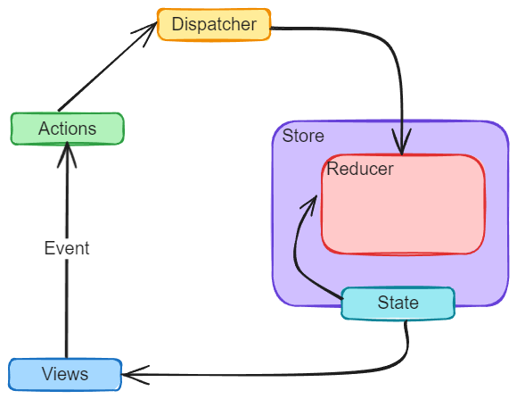

---
tags:
  - React
  - 前端
date: 2025-01-25
cover: https://redux.js.org/img/redux.svg
---

# Redux —— React 中的状态管理库

## Redux 的核心思想

早期的时候，React 官方提供了 Flux，Flux 的特点如下：

- 单向数据流，视图事件或外部测试用例发出 Action，经由 Dispatcher 派发给 Store，Store 会触发相应的方法更新数据和视图。
- Store 可以有多个。
- Store 不仅存放数据，还封装了处理数据的方法。

2015 年的时候，Dan Abramov 推出的 Redux 席卷了整个 React 社区，其本质就是在 Flux 上做了一些更新：

- 单向数据流，View 发出 Action(store.dispatch(action))，Store 调用 Reducer 计算出新的 State，若 State 产生变化，则调用监听函数重新渲染 View(store.subscribe(render))。
- 单一数据源，只有一个 Store。
- state 是只读的，每次更新后只能返回一个新的 state。
- 没有 Dispatcher，而是在 Store 中集成了 dispatch 方法，store.dispatch() 是 View 发出 Action 的唯一途径。
- 支持使用中间件管理异步数据流。



## ToDos Demo

1. 基本结构

   :::code-group

   ```js [index.js]
   import React from 'react';
   import ReactDOM from 'react-dom/client';
   import App from './App';
   import { store } from './redux/store';

   const root = ReactDOM.createRoot(document.getElementById('root'));

   root.render(<App store={store} />);

   store.subscribe(() => {
     root.render(<App store={store} />);
   });
   ```

   ```js [App.jsx]
   import List from './components/List';
   import Input from './components/Input';
   import './css/App.css';

   function App(props) {
     return (
       <div className="container">
         <h1
           className="lead"
           style={{
             marginTop: '20px',
             marginBottom: '30px',
           }}
         >
           待办事项
         </h1>
         <Input store={props.store} />
         <List store={props.store} />
       </div>
     );
   }

   export default App;
   ```

   ```css [App.css]
   .container {
     width: fit-content;
   }

   h1 {
     text-align: center;
   }

   ul {
     list-style-type: none;
     padding: 0;
   }

   .item {
     cursor: pointer;
   }

   .completed {
     text-decoration: line-through;
   }
   ```

   ```html [index.html]
   <!doctype html>
   <html lang="en">
     <head>
       <meta charset="utf-8" />
       <link rel="icon" href="%PUBLIC_URL%/favicon.ico" />
       <meta name="viewport" content="width=device-width, initial-scale=1" />
       <meta name="theme-color" content="#000000" />
       <meta
         name="description"
         content="Web site created using create-react-app"
       />
       <link
         rel="stylesheet"
         href="https://cdn.jsdelivr.net/npm/bootstrap@5.3.3/dist/css/bootstrap.min.css"
       />

       <title>React App</title>
     </head>
     <body>
       <noscript>You need to enable JavaScript to run this app.</noscript>
       <div id="root"></div>
     </body>
   </html>
   ```

   :::

2. 组件代码

   :::code-group

   ```jsx [Input.jsx]
   import React from 'react';
   import { addListAction } from '../redux/actions';

   export default function Input(props) {
     const [value, setValue] = React.useState('');
     function handleClick() {
       props.store.dispatch(addListAction(value));
       setValue('');
     }
     return (
       <div className="row">
         <div className="col-md-8">
           <input
             type="text"
             className="form-control"
             placeholder="请输入待办事项"
             value={value}
             onChange={(e) => setValue(e.target.value)}
           />
         </div>
         <div className="col-md-4">
           <button
             className="btn btn-primary"
             onClick={() => handleClick(value)}
           >
             添加
           </button>
         </div>
       </div>
     );
   }
   ```

   ```jsx [List.jsx]
   import React from 'react';
   import { deleteListAction, updateListAction } from '../redux/actions';

   export default function List(props) {
     return (
       <div>
         <ul
           style={{
             display: 'flex',
             flexDirection: 'column',
             gap: '10px',
             marginTop: '20px',
           }}
         >
           {props.store.getState().list.map((item) => (
             <li
               key={item.id}
               className="text-primary"
               style={{
                 fontSize: '20px',
                 width: '310px',
                 display: 'flex',
                 justifyContent: 'space-between',
                 alignItems: 'center',
               }}
             >
               <span
                 className={['item', item.completed ? 'completed' : ''].join(
                   ' ',
                 )}
                 onClick={() => props.store.dispatch(updateListAction(item.id))}
               >
                 {item.title}
               </span>
               <button
                 className="btn btn-danger"
                 onClick={() => props.store.dispatch(deleteListAction(item.id))}
               >
                 删除
               </button>
             </li>
           ))}
         </ul>
       </div>
     );
   }
   ```

   :::

3. Redux 相关

   :::code-group

   ```js [store.js]
   import { createStore } from 'redux';

   import { todoReducer } from './reducers';

   export const store = createStore(
     todoReducer,
     window.__REDUX_DEVTOOLS_EXTENSION__ &&
       window.__REDUX_DEVTOOLS_EXTENSION__(),
   );
   ```

   ```js [actionType.js]
   export const ADD = 'ADD';
   export const DELETE = 'DELETE';
   export const CHANGE = 'CHANGE';
   ```

   ```js [actions.js]
   import { ADD, DELETE, CHANGE } from './actionType';

   export const addListAction = (payload) => ({
     type: ADD,
     payload,
   });

   export const deleteListAction = (payload) => ({
     type: DELETE,
     payload,
   });

   export const updateListAction = (payload) => ({
     type: CHANGE,
     payload,
   });
   ```

   ```js [reducers.js]
   import { ADD, DELETE, CHANGE } from './actionType';

   let defaultState = {
     list: [
       { id: 1, title: 'Learn React', completed: false },
       { id: 2, title: 'Learn Redux', completed: false },
       { id: 3, title: 'Learn React Native', completed: false },
     ],
   };

   export function todoReducer(state = defaultState, action) {
     switch (action.type) {
       case ADD:
         return {
           list: [
             ...state.list,
             {
               id: Date.now(),
               title: action.payload,
               completed: false,
             },
           ],
         };
       case DELETE:
         return {
           list: state.list.filter((item) => item.id !== action.payload),
         };
       case CHANGE:
         return {
           list: state.list.map((item) => {
             if (item.id === action.payload) {
               item.completed = !item.completed;
             }
             return item;
           }),
         };
       default:
         return state;
     }
   }
   ```

   :::
