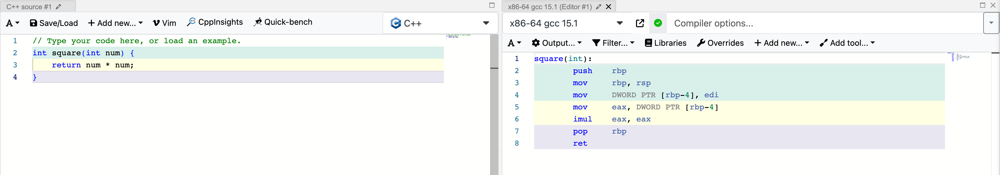
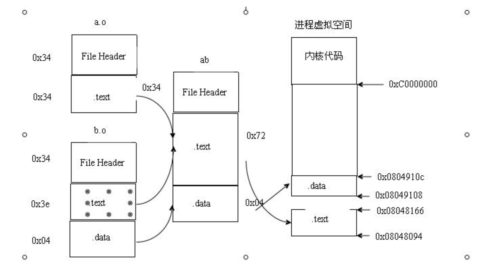
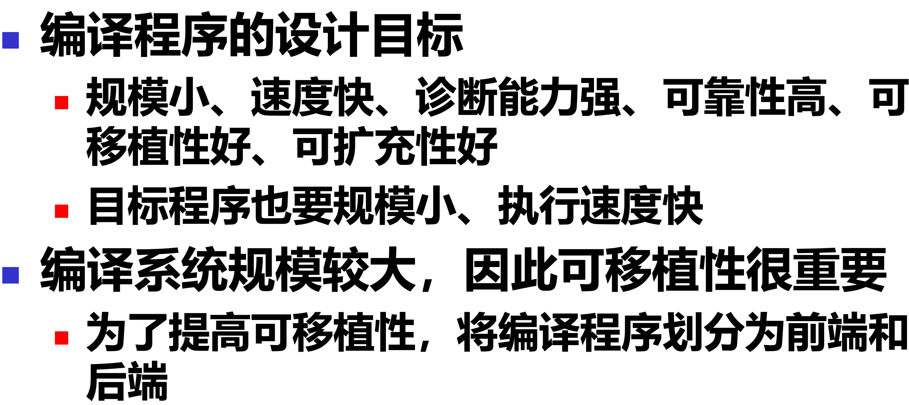
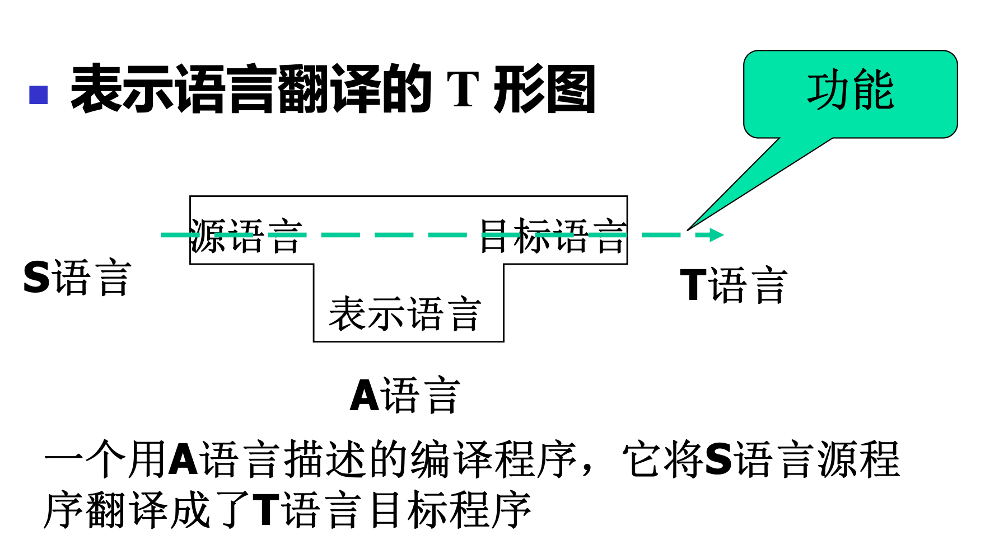

# 编译原理：90% 的人根本没懂却硬着头皮过了

> [!NOTE] 🤔 这是什么样的一门课？
> 说它不难吧，它还确实难；可你要说它没用，那你说对了。
>
> 你问我考试怎么办？编译原理、编译原理，靠编呗。

## 文前说明

- 题型包括 `简答`、`证明`、`论述`、`设计` 等。
- 总分 = 0.1 \* 平时分 + 0.2 \* 实验分 + 0.7 \* 期末
- 总体要求：
  - 掌握编译程序的整体结构
  - 编译程序各个部分的任务
  - 编译过程各个阶段的工作原理
  - 编译过程各个阶段要解决的问题和采用的技术

## 第一章 引论

> [!Important] ⛺ 重难点
> 重点：编译系统的结构和编译程序的生成
>
> 难点：编译程序的生成

### 程序设计语言

应该都知道——机器语言、汇编语言、高级语言。

### 程序设计语言的翻译

高级程序语言分为解释型语言和编译型语言，所以翻译程序就会有 `解释程序` 和 `编译程序`。

解释程序就是边解释边执行，每执行一条语句都会涉及到数据的读写等，可以类比为同声传译；

编译程序就是完整地把一份代码转化为更接近底层的，比如高级程序语言被编译成汇编语言或者机器语言，可以类比为通篇翻译。

:::tip 📌 提示

1. 编译程序，再加上运行系统，就能组成编译系统。
2. 这里只列出了这两种翻译程序，只是因为高级程序语言向可执行文件的转化包括这两种。下面再列出几种翻译程序：
   - 汇编程序：将汇编语言代码转化为机器语言；
   - 交叉汇编程序：把 A 上编写的汇编语言转化为 B 机器的机器语言；
   - 反汇编程序：顾名思义，机器语言转化为汇编；
   - 交叉编译程序：把 A 上编写的高级程序转化为 B 机器的汇编语言/机器语言；
   - 可变目标编译程序、并行编译程序、诊断编译程序、优化编译程序……

:::

### 编译程序总体结构

:::warning ⚠️ 注意
下面实际上说的是编译程序的流程，所以如果谈及程序结构，你应该说的是词法分析器、语法分析器……
:::

- `词法分析`，这一步交给词法分析器/扫描器，逐个字符串扫描转化为 Tokens，并进行符号表管理和错误记录（把你的高级语言程序转化为一个一个 kv 对）；
- `语法分析`，这一步是语法分析器的任务，把 Tokens 转化为 AST，并记录过程中的错误（把单词对连成句子）；
- `语义分析`，一般和语法分析合称为 `语法制导翻译（SDT）`，获取标识符属性/语义检查/子程序和变量的静态绑定，结果可以是各种形式的中间代码（解释这些玩意，检查有没有不合理的地方）；
- `代码优化`，顾名思义吧，机器自己生成也不能给自己造一堆屎山，时间要快、空间要小；
  - 与机器无关的优化：局部优化 = 常量提前合并 + 公共子表达式提取；全局优化 = 强度削减（快的操作代替慢的） + 代码外提（不变的不必要循环）；
  - 与机器有关的优化：时间优化（SIMD/MIMD/MPMD 并行/指令流水化） + 空间优化（存储体系优化，eg. Cache/寄存器）。
- `代码生成`：给对象分配存储空间，确定翻译算法，形成最终代码；
- `错误处理`：进行各种错误的检查、报告、纠正，以及相应的续编译处理(如：错误的定位与局部化)；
  - 词法分析可能的错误：拼写错误、非法字符等；
  - 语法分析可能的错误：表达式、句子或程序结构错误等；
  - 语义分析可能的错误：类型匹配错误、参数匹配错误、非法转移等。
- `表格管理`：管理各种符号表，涉及到相关数据结构如 HashMap 的查找和填写

> 事实上，可以把前三步划分进分析模块，中间两步划分为综合模块，最后两步是辅助模块。

:::details 🌰 举个栗子

1. 我们规定一段高级程序语言（如 C 语言）并对其做[词法分析](https://wgrape.github.io/lexer/?lang=c&codearea=editor)。

   然后得到一些 kv 对，比如 `Map { keyword -> int, Float -> 928.2332 }`

    <VideoPlayer platform="local" src="/videos/录屏2025-05-01 23.15.02.mov" />

2. [语法制导翻译](https://astexplorer.net/)部分，我们会得到 AST，其中可能会涉及到一些文法规则和产生式的概念。

   <VideoPlayer platform="local" src="/videos/录屏2025-05-01 23.34.59.mov" />

3. [目标代码生成](https://godbolt.org/)。

   

:::

:::details 🔍 补充信息

1. 中间代码的优点：简单规范、与机器无关、易于优化和转换；
2. 关于代码优化的一些装\*用语：
   - 过早的优化是万恶之源。（尤其是这句，装没边了。）
   - 让正确的程序更快，要比让快速的程序正确容易得多。
   - 将最多的努力投入到运行消耗时间最多的代码中。
   - 优化的层次越高，就会越有效，最好的优化是找到一个更有效的算法。
   - 将程序编写和优化当作独立的步骤来做。
   - 性能分析数据应该是第一位，最后才是直觉。
3. 代码生成允许是不同形式的：

   

   目标代码从编译生成的目标文件（如 a.o、b.o），经过链接器合并生成可执行文件（ab），再由操作系统加载到进程虚拟地址空间。

   分别对应：模块结构的机器指令 → 可执行文件 → 内存中带虚拟地址的指令与数据段。

   

:::

### 编译程序的组织

1. 通常称编译程序对源程序或中间结果的完整扫描为遍。
2. 遍可以和阶段相关，也可以和阶段无关。
3. 编译程序的遍数可以根据采用的编程语言、系统追求的目标和计算机资源情况做出优化。
4. 编译程序因此可以分为单遍扫描和多遍扫描。
5. 可以将一个编译程序设计成多遍（Pass）扫描的形式，在每一遍扫描中，完成不同任务。如：首遍构造语法树，二遍处理中间表示、增加信息等。
6. 一般来说，分析工作可以单独作为一遍，代码的生成和优化各自作为一遍。
7. 自己看图吧 ⬇️

   

   <mark>不同机器上前端可复用，相同机器不同语言后端可复用。</mark>

### 编译程序的生成

:::details 🌰 下面的问答可能会有些烧脑，建议多次理解，如果还是不懂就请 GPT 大人吧……

🌶️ 如何生成一个编译程序？

利用现有的工具和编译程序，通过移植、自展等方法完成新的编译程序。

🌶️🌶️ 如何直接在一个机器上实现 C 语言编译器？

> 其实这个问题在 PPT 写的不够完整，问题应该是想要在一台裸机实现这样一个目标，这也解释了为什么只能从汇编语言出发，而不能采取其他的高级程序语言。

1️⃣ 用这台机器已有的汇编语言实现一个可以识别和翻译 C 语言子集的编译器 P0，比如可以处理简单的循环、分支等。

2️⃣ 用这台机器已有的编译器 P1 把上面得到的程序 P0 做编译，得到了机器码的可执行文件 P2。

到这一步，我们得到了 P2，给他一段 C 子集程序，我们就可以得到编译以后可运行的结果。P2 就是一个初级编译器。

3️⃣ 既然已经有了初级编译器，就干脆用前面抽离的 C 子集语言编写对复杂程序的识别和翻译的程序，让这个 P2 输出就可以了，这一步得到 P3。

4️⃣ 接下来，用 P2 处理 P3，得到的就是最终结果。

事实上，这个过程叫做“自举”，从较为底层的语言出发，逐步摆脱束缚实现对高层语言的编译。

> 上面的这一 part 建议搞明白每个阶段的输入输出，会对理解起一些帮助作用。

🌶️🌶️🌶️ 怎么利用一台机器上的现成的编译器实现另一台机器上的编译器？

先把这两台机器称为 A 和 B，方便后面对照。

1️⃣ 首先，B 上有一段编译程序 P0，输入是 C 语言，输出是等待被转化为机器码的中间代码（称呼可能不严谨，凡是便于理解）。

2️⃣ A 上有现成的编译器 P1，输入 C，输出最终结果。把 P0 交给它，编译之后不就是 A 上的可运行吗？我们把它叫做 P2，接下来，我们应该考虑怎么转化为 B 的结果。

3️⃣ P2 输入就是 C，输出就是可运行的，那再把 P0 给它，不就得到 B 上的可运行了吗？Ending。

🌶️🌶️🌶️🌶️ 有现成的 C 语言编译器，怎么实现 R 语言编译器？

C 语言编译器就是输入一段 C 语言，得到一个可执行。那我们就可以输入一段 C，这段 C 用来识别和翻译 R，得到的可执行就可以称之为 R 编译器了。

🌶️🌶️🌶️🌶️🌶️ 编译程序其实是可以自动生成的。

| 阶段 | 词法分析器的自动生成程序                           | 语法分析器的自动生成程序                       |
| ---- | -------------------------------------------------- | ---------------------------------------------- |
| 工具 | LEX                                                | YACC                                           |
| 输入 | 词法规则说明（正规表达式） 识别动作（C 程序段） | 语法规则说明（产生式） 语义动作（C 程序段） |
| 输出 | 词法分析程序（C 程序） yylex() 函数             | 语法分析程序（C 程序） yyparse() 函数       |

:::

## 第二章 高级语言及其文法

> [!Important] ⛺️ 重难点
>
> 重点：文法的定义与分类、CFG 的语法树及二义性、程序设计语言的定义
>
> 难点：程序设计语言的语义

### 语言概述

1. 语言是一定的群体用来进行信息交流的工具。

   语言的基础包括 `字(最小单位)` 和 `规则(生成规则和理解规则)`。

2. 自然语言和计算机语言的对比

   | 语言种类 | 自然语言                         | 计算机语言                           |
   | -------- | -------------------------------- | ------------------------------------ |
   | 定义     | 人与人之间的通信工具             | 计算机系统间以及人与系统间的通信工具 |
   | 特征     | 语法和语义不严格 不容易形式化 | 语法和语义严格 易于形式化         |

3. 语言的描述方法分为 `自然语言描述` 和 `数学语言描述`（对照上面表格），前者自然方便且非形式化，后者严格准确且形式化。

   综合二者优点，可以得到新的一种方法 —— `形式化描述`，其特点是：高度抽象、具有严格的理论基础和方便的计算机表示。

4. 经过形式化的内容提取，一般的语言可以得到三部分，分别是 `语言`、`句子`、`单词`，含义分别为满足一定规则的句子集合、单词序列、字符串。

   程序设计语言则分为四个部分，`程序设计语言`、`程序`、`语句` 和 `单词`。含义分别为组成程序的所有语句的集合、满足语法规则的语句序列、满足语法规则的单词序列、满足词法规则的字符串。

5. 词法，单词的组成规则，可以通过 BNF 范式、正规式等描述；

   语法，语句的组成规则，可以通过 BNF 范式、语法（描述）图等描述。

6. 形式语言与自动机理论的产生和作用，这一 part 感觉没什么……

   - 文法与自动机具有等价性。
   - 巴克斯范式是上下文无关文法的一种表示方式。

### 基本定义

1. `字母表`，是一个非空有穷集合，其中元素被称为字母/字符，元素具有整体性和可辨认性。
2. `字母表的乘积`，定义为所有元素之间的全排列。

   $$ \Sigma_0 = \{0, 1\} $$
   $$ \Sigma_1 = \{a, b\} $$
   $$ \Sigma_0 = \{0a, 1a, 0b, 1b\} $$

3. `字母表的幂`，定义为递归排列，0 次幂定义为空语句。

   $$ \Sigma^0 = \{\varepsilon\} $$

   $$
   \Sigma^n = \Sigma^{n-1} \Sigma,\quad n \geq 1
   $$

   $$\Sigma_1^3 = \{000, 001, 010, 011, 100, 101, 110, 111\}$$

4. `字母表的正闭包和克林闭包`，定义如下：

   $$
   \Sigma^+ = \bigcup_{n=1}^{\infty} \Sigma^n
   $$

   $$
       \Sigma^* = \bigcup_{n=0}^{\infty} \Sigma^n = \Sigma^+ \cup \Sigma^0 = \Sigma^0 \cup \{\varepsilon\}
   $$

5. 设 $\Sigma$ 是一个字母表，$\forall x \in \Sigma^*$，$x$ 称作是字母表上的一个 `句子`，$\varepsilon$ 是 `空句子`。
6. 设 $\Sigma$ 是一个字母表，$\forall x,y \in \Sigma^*,a \in \Sigma$，$xay$ 中的 $a$ 称作 $a$ 在该句子中的一个 `出现`。
7. 设 $\Sigma$ 是一个字母表，$\forall x \in \Sigma^*$，句子 $x$ 中字符出现的总个数叫做该字符的 `长度`，记作 $\left| x \right|$。
8. 设 $\Sigma$ 是一个字母表，$\forall x,y \in \Sigma^*$，$x,y$ 的 `并置/联结` 就是两个串直接相连的结果，记作 $xy$。
9. 设 $\Sigma$ 是一个字母表，$\forall x,y,z \in \Sigma^*$：

   如果 $x = yz$，$y$ 是 $x$ 的 `前缀`，$z$ 是 $x$ 的 `后缀`；

   如果 $z \neq \varepsilon$，$y$ 是 $x$ 的 `真前缀`；如果 $y \neq \varepsilon$，$z$ 是 $x$ 的 `真后缀`。

   > $前缀 = 真前缀 \cup 句子本身 \quad 后缀 = 真后缀 \cup 句子本身$

10. 设 $\Sigma$ 是一个字母表，$\forall x,y,z,w,v \in \Sigma^*$：

    如果 $x = yz, w = yv$，称 $y$ 是 $x$ 和 $w$ 的 `公共前缀`，公共前缀中最长的就是 `最大公共前缀`；

    如果 $x = zy, w = vy$，称 $y$ 是 $x$ 和 $w$ 的 `公共后缀`，公共前缀中最长的就是 `最大公共后缀`。

11. 设 $\Sigma$ 是一个字母表，$\forall w，x,y,z \in \Sigma^*$，如果 $w = xyz$，则称 $y$ 是 $w$ 的一个 `子串`。
12. 设 $\Sigma$ 是一个字母表，$\forall t,u,v,w，x,y,z \in \Sigma^*$：

    如果 $t = uvy,w = xyz$，则称 $y$ 是 $t$ 和 $w$ 的一个 `公共子串`;

    同理，所有公共子串中最长的就是 `最大公共子串`。

13. 设 $\Sigma$ 是一个字母表，$\forall L \subsetneq \Sigma^*$，$L$ 称作是字母表上的一个 `语言`，其中的元素就是 `句子`。

### 文法的定义

🔖 这一节主要分为两个 part，定义句子规则和使用句子规则。

🔖 换句话说，`确定一套文法`，然后 `利用这套文法判断一个句子属于一种语言`。

1. 文法的出现是为了实现语言结构的形式化描述，采用 $左部量 = 右部表达式$ 的赋值语句结构。
2. `定义句子规则的语法组成`，又可以分为`开始符号`、`语法规则`、`非终结符号集` 和 `终结符号集`。
3. `文法形式`，$G = (V, T, P, S)$：

   V：非终结符号集，每个非终结符称为一个语法变量，代表某个语言的各种子结构；

   T：语言的句子中出现的字符，$V \cap T = \emptyset$；

   S：代表文法定义的语言，至少在左侧出现一次，$S \in V$；

   P：产生式/定义式集合，定义各个语法成分的结构（组成规则）。元素形如 $\alpha \Rightarrow \beta$，表示 $\alpha$ 被定义为 $\beta$。其中，$\alpha \in (V \cup T)^+$，$\beta \in (V \cup T)^*$，且 $\alpha$ 中至少要有 $V$ 中一个元素出现。$\alpha$ 和 $\beta$ 分别被称为该产生式的左部和右部。

4. `产生式是可以简写的`，$\alpha \Rightarrow \beta_1 \mid \beta_2 \mid \ldots \mid \beta_n$ 是 $\alpha \Rightarrow \beta_1, \alpha \Rightarrow \beta_2, \ldots, \alpha \Rightarrow \beta_n$ 的简写，$\beta_1, \beta_2, \ldots, \beta_n$ 称为 `候选式`。
5. 对一个文法 $G = (V, T, P, S)$，可以只列出该文法的所有产生式，且所列的第一个产生式的左部是该文法的开始符号。
6. 一般来讲，大写字母表示语法变量，小写字母表示终结符号。

🔖 接下来就是 part two。

1. 设 $G = (V, T, P, S)$ 是一个文法，如果 $\alpha \Rightarrow \beta \in P, \gamma, \delta \in (V \cup T)^*$，则称 $\gamma \alpha \delta$ 在 $G$ 中 `直接推导` 出 $\gamma \beta \delta$ ，$\gamma \beta \delta$ 在 $G$ 中 `直接归约` 出 $\gamma \alpha \delta$。记作 $\gamma \alpha \delta \xRightarrow[\scriptsize G]{} \gamma \beta \delta$, $\gamma \beta \delta \xLeftarrow[\scriptsize G]{} \gamma \alpha \delta$，意义明确时可以省略箭头下方的 $G$。

   > 在不特别强调推导/归约的直接性时，`直接推导` 可以简称为 `推导或派生`，`直接归约` 可以简称为 `归约`。将 $\gamma \alpha \delta$ 中的 $\alpha$ 变成了 $\beta$（或相反），$\gamma$ 和 $\delta$ 都没有变化，所以又称将 $\alpha$ 推导成 $\beta$ 或 将 $\beta$ 归约成 $\alpha$。

2. 若存在多步推导，比如 $\alpha_0 \Rightarrow \alpha_1 \Rightarrow \alpha_2 \Rightarrow \ldots \Rightarrow \alpha_n$，可以记作：

   $$
      \alpha_0 \xRightarrow{n} \alpha_n, \quad 恰好经过 n 步 推导
   $$

   $$
      \alpha_0 \xRightarrow{+} \alpha_n, \quad 至少经过一步推导
   $$

   $$
      \alpha_0 \xRightarrow{*} \alpha_n, \quad 经过了若干步推导且可为 0 次
   $$

3. 若存在多步归约……

🔖 Part two 除了如何利用文法，还讲到了利用文法产生的是什么。

1. 设 $G = (V，T，P，S)$ 是一个文法，对于 $\forall A \in V$，令 $L(A) = \left\{ x \mid A \xRightarrow[]{+} x,\ x \in T^* \right\}$，$L(A)$ 就是语法变量 $A$ 所代表的集合。
2. 设 $G = (V，T，P，S)$ 是一个文法，令 $L(G) = \left\{ w \mid S \xRightarrow[]{*} w,\ w \in T^* \right\}$，$L(G)$ 就是文法 $G$ 所产生的 `语言`，$\forall w \in L(G)$，$w$ 称为 $G$ 产生的一个 `句子`。

   > 显然，对于任意一个文法 $G$，$G$ 产生的语言 $L(G)$ 就是该文法的开始符号 $S$ 所代表的集合 $L(S)$。

3. 设文法 $G = (V, T, P, S)$，对于 $\forall \alpha \in (V \cup T)^*$，如果 $S \xRightarrow{*} \alpha$，则称 $\alpha$ 是 $G$ 产生的一个 `句型`。

   :::tip 📌 句子和句型的区别

   1. 句子满足的条件是 $\forall w \in T^*$，而句型满足的条件是 $\forall \alpha \in (V \cup T)^*$ 。
   2. 句子推导出的不包含语法变量，句型可能包含语法变量。
   3. 句子一定是句型，句型不一定是句子。

   :::

### 文法的分类

⚡️ 这一部分被称为 `乔姆斯基体系`。

根据语言结构的复杂程度，可以分为 `0 型文法`、`1 型文法`、`2 型文法` 和 `3 型文法`，分别又被称作 `短语结构文法`、`上下文有关文法`、`上下文无关文法` 和 `正规文法`。

:::info ⛽️ 语言结构的复杂程度

1. 文法的复杂程度
2. 分析方法的选择
3. 这套文法能描述语言的能力强弱

:::

| 分类     | 0 型文法                                          | 1 型文法                                         | 2 型文法                             | 3型文法                                                       |
| -------- | ------------------------------------------------- | ------------------------------------------------ | ------------------------------------ | ------------------------------------------------------------- |
| 名称     | PSG                                               | CSG                                              | CFG                                  | RG                                                            |
| 语言类型 | PSL                                               | CSL                                              | CFL                                  | RL                                                            |
| 定义     | 满足文法定义的要求                                | 右部长度不小于左部                               | 右部长度比左部大 左部是非终结符号 | 左线型文法或右线型文法                                        |
| 文法形式 | $\alpha \Rightarrow \beta$                        | $\alpha A \beta \Rightarrow \alpha \gamma \beta$ | $A \Rightarrow \beta$                | $A \Rightarrow aB$ $A \Rightarrow a$ $A \Rightarrow Ba$ |
| 左部限制 | $\alpha \in (V \cup T)^+$ 且含至少一个非终结符 | 长度小                                           | 只能是单个非终结符 $A$               | 只能是单个非终结符 $A$                                        |
| 右部限制 | 无                                                | 长度大或相等                                     | 任意符号串（可以为空串）             | 一个终结符和一个非终结符 或者只是一个终结符                |

:::warning ⚠️ 注意
必须是该文法中所有产生式都满足对应条件，才能被分入某一文法的分类中。
:::

:::tip 📌 和高级程序设计语言的关联

1. CFG 能描述程序设计语言的多数语法成分。
2. RL 能描述程序设计语言的多数单词。
3. 左线性文法和右线性文法等价，只是识别句子的方向不同。
4. 两种线型文法等价，进而对应的语言也等价。
5. $RG \subset CFG \subset CSG \subset PSG,\quad RL \subset CFL \subset CSL \subset PSL$

:::

:::details 🌰 一些判断
$G_1 : S \Rightarrow 0 \mid 1 \mid 00 \mid 11$

$G_2 : S \Rightarrow A \mid B \mid AA \mid BB, \quad A \Rightarrow 0, \quad B \Rightarrow 1$

$G_3 : S \Rightarrow 0 \mid 1 \mid 0A \mid 1B, \quad A \Rightarrow 0, \quad B \Rightarrow 1$

$G_4 : S \Rightarrow A \mid B \mid BC, \quad A \Rightarrow 0, \quad B \Rightarrow 1,\quad C \Rightarrow 21,\quad C \Rightarrow 11,\quad C \Rightarrow 2$

$G_5 : S \Rightarrow 0 \mid 0S$

$G_6 : S \Rightarrow \varepsilon \mid 0S$

$G_7 : S \Rightarrow \varepsilon \mid 00S111$

$G_8 : A \Rightarrow aS \mid bS \mid cS \mid a \mid b \mid c$

$G_9 :$

$$
S \Rightarrow 0A \mid 1B \mid 2C \mid 0SA \mid 1SB \mid 2SC
$$

$$
0A \Rightarrow A0,\quad 1A \Rightarrow A1,\quad 2A \Rightarrow A2
$$

$$
0B \Rightarrow B0,\quad 1B \Rightarrow B1,\quad 2B \Rightarrow B2
$$

$$
0C \Rightarrow C0,\quad 1C \Rightarrow C1,\quad 2C \Rightarrow C2
$$

$G_10 :$

$$
S \Rightarrow aT \mid bT \mid cT
$$

$$
T \Rightarrow \varepsilon \mid a \mid b \mid c \mid 0 \mid 1 \mid 2 \mid 3  \mid aT \mid bT \mid cT \mid 0T \mid 1T \mid 2T \mid 3T
$$

🔑 答案为 32323 32313。

❗️ 注意 1/2/3 型文法允许空语句存在。
:::

:::details 🌰 构造语言 $\left\{ 123456 \right\}$ 的 $G_{left/right}$

$G_{left} :$

$$
S_{left} \Rightarrow A_{left}6
$$

$$
A_{left} \Rightarrow B_{left}5
$$

$$
B_{left} \Rightarrow C_{left}4
$$

$$
C_{left} \Rightarrow D_{left}3
$$

$$
D_{left} \Rightarrow E_{left}2
$$

$$
E_{left} \Rightarrow 1
$$

$G_{right} :$

$$
S_{right} \Rightarrow 1A_{lright}
$$

$$
A_{lefright} \Rightarrow 2B_{lefright}
$$

$$
B_{lefright} \Rightarrow 3C_{lefright}
$$

$$
C_{lefright} \Rightarrow 4D_{lefright}
$$

$$
D_{lefright} \Rightarrow 5E_{lefright}
$$

$$
E_{lefright} \Rightarrow 6
$$

:::

### CFG 语法树

> 语法树存在的目的，是为了更清晰地表示文法的结构以及推导和归约的过程。

1. `基本定义`：用树的形式表示句型的生成。树根就是开始符号，中间节点代表非终结符，叶节点可能是终结符或非终结符的一种。其中，每个推导都代表一个中间节点及其孩子集合。CFG 语法树又叫做分析树、推导树或者派生树。
2. 设有 CFG 满足：

   $$
      G = (V, T, P, S)
   $$

   $$
      \exists \alpha,\beta,\gamma \in (V \cup T)^* \quad 实现 \quad S \xRightarrow{*} \gamma A \beta \quad 且 \quad A \xRightarrow{+} \alpha
   $$

   则称 $\alpha$ 是句型 $\gamma \alpha \beta$ 相对于变量 $A$ 的 `短语`。

   如果 $A \Rightarrow \alpha$，则称为 `直接短语`。

3. 对于一个 CFG，$G$ 的 `最左直接短语` 叫做 `句柄`。

   :::info ⛽️ 子树解释短语/直接短语/句柄

   - 短语：一棵子树的所有叶子自左至右排列起来形成一个相对于子树根的短语。
   - 直接短语：仅有父子两代的一棵子树，它的所有叶子自左至右排列起来所形成的符号串。
   - 句柄：一个句型的分析树中最左那棵只有父子两代的子树的所有叶子的自左至右排列。

   :::

4. 基于最左/最右变量的推导可以被叫做 `最左/右推导`，分别与 `最右/左归约` 对应 ，过程中得到的句型叫做 `最左/右句型`。

   > 最左归约也被称作 `规范归约`。

   :::warning ⚠️ 注意
   最左归约与最右归约针对的都是 **直接短语**！！！
   :::

5. 如果一个文法的句子存在两棵分析树，那么该句子是二义性的。如果一个文法包含二义性的句子，则称这个文法是二义性的。

   <mark>通过提升一些运算符的优先级，可以达到消除二义性的目的。</mark>

   <mark>但有的情况消除之后句式复杂，在能驾驭的情况下可以使用二义性句子。</mark>

## 第三章 词法分析

> [!Important] ⛺ 重难点
> 重点：词法分析器的输入、输出，用于识别符号的状态转移图的构造，根据状态转移图实现词法分析器
>
> 难点：词法的正规文法表示、正规表达式表示、状态转移图表示，以及它们之间的转换

### 词法分析器的功能

🔖 输入源程序，输出单词符号。即把构成源程序的字符串转换成“等价的”单词序列。

过程中，词法分析器还需要处理：

- 根据词法规则识别及组合单词，进行词法检查；
- 对数字常数完成数字字符串到二进制数值的转换；
- 删去空格和注释等不影响程序语义的字符。

::::info ⛽️ 关于单词

1. 单词可以分为 `关键字`、`标识符`、`常量`、`运算符` 和 `分界符`。
2. 两种常用的单词内部表示形式，分别是 `按单词种类分类` 和 `固定数量单词采用一符一类`。

   :::details 🔍 详情解释

   | 单词名称     | 类别编码 | 单词值           |
   | ------------ | -------- | ---------------- |
   | 标识符       | 1        | 内部字符串       |
   | 无符号整数   | 2        | 整数值           |
   | 无符号浮点数 | 3        | 数值             |
   | 布尔常数     | 4        | 0 或 1           |
   | 字符串常数   | 5        | 内部字符串       |
   | 关键字       | 6        | 关键字或内部编码 |
   | 分界符       | 7        | 分界符或内部编码 |
   | 运算符       | 8        | 运算符或内部编码 |

   | 单词名称       | 类别编码 | 单词值     |
   | -------------- | -------- | ---------- |
   | 标识符         | 1        | 内部字符串 |
   | 无符号常数(整) | 2        | 整数值     |
   | 无符号浮点数   | 3        | 数值       |
   | 布尔常数       | 4        | 0 或 1     |
   | 字符串常数     | 5        | 内部字符串 |
   | BEGIN          | 6        | -          |
   | END            | 7        | -          |
   | FOR            | 8        | -          |
   | DO             | 9        | -          |
   | :              | 20       | -          |
   | +              | 21       | -          |
   | \*             | 22       | -          |
   | ,              | 23       | -          |

   - 对于第二种方法，就是将关键字、运算符和分界符做单独存储，不存储属性值。
   - 存储标识符和常量的属性值，可以直接存储，也可以指针存储。

   :::

::::

🔖 源程序以字符流的形式存储在外部介质中，因此需要 `输入缓冲与预处理` 等一系列操作：

- 超前搜索：标识符或双字运算符的识别；
- 回退搜索：回退修正超前的误差；
- 缓冲区存储，提升读写效率；
- 空白字符的剔除；

> 采用的是双缓冲区，避免了单缓冲区容量有限引起的等待问题和覆盖问题。

> 采用带标记缓冲区，能将向前指针边界检测次数降低到 N 次左右。

🔖 不要忘记之前提到的，我们还需要做错误处理：

- `非法字符检查`：维护一个合法字符集合，对于每一个输入的字符做判断；
- `单词拼写检查`：关键字拼写错误只能放在语法分析阶段，标识符拼写错误可以拆分成正确的或者直接 error；
- `不封闭错误检查`：说人话，就是字符串长度或者注释行数等，会影响程序分析；
- `重复声明检查`：兼顾符号表的读写工作。
- `错误恢复与续编译`：解决错误（往往比较困难）或者跳过错误（回退到一个正确的记录）

🔖 那么，词法分析器单独作为一个子程序，有什么好处呢？

- 简化编译器的设计；
- 提高编译器的效率；
- 增强编译器的可移植性。

### 单词的描述

……
